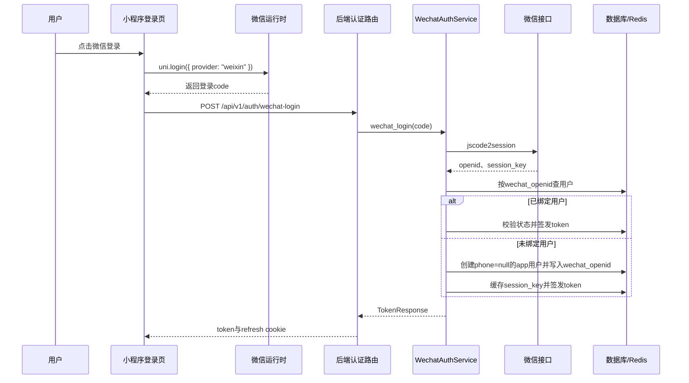
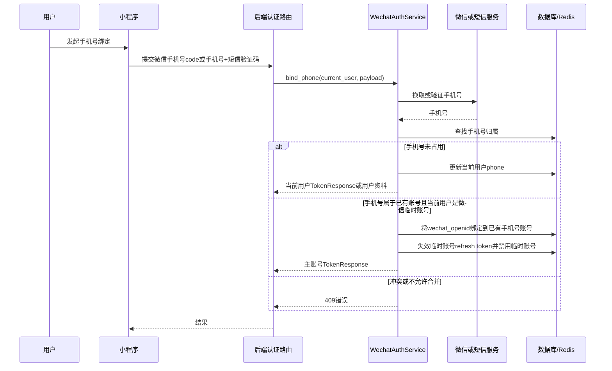

# 微信快速登录与手机号绑定设计

## 背景

小程序登录页已经展示“微信”入口，但当前只是占位提示。后端 `users` 表已有 `wechat_openid` 唯一字段，认证服务目前只支持手机号注册、手机号/用户名密码登录、refresh 和 logout。钱包充值等能力已经依赖 `wechat_openid`，因此需要把微信登录、OpenID 绑定和手机号绑定补成完整闭环。

## 目标

- 用户点击微信登录后，后端通过微信 code 换取 `openid/session_key`。
- 如果 `openid` 已绑定用户，直接签发现有 `TokenResponse`。
- 如果 `openid` 未绑定用户，创建 `phone = null` 的 app 用户，写入 `users.wechat_openid`，立即签发 token。
- 用户后续可绑定手机号：优先微信手机号授权，失败时提供短信验证码备用绑定。
- 如果绑定手机号已属于已有账号，将无手机号微信临时账号合并到已有手机号账号，并把 `wechat_openid` 绑定到主账号。
- 保持手机号密码登录、注册、refresh/logout 的现有行为不变。

## 非目标

- 不做管理后台微信登录。
- 不做复杂资产迁移；临时微信账号如果已有余额、订单、优惠券等资产，默认阻止自动合并。
- 不把 `session_key` 暴露给前端。
- 不删除已绑定的 `wechat_openid` 作为回滚手段。

## 架构

新增 `WechatAuthService`，保持现有 `AuthService` 聚焦手机号注册、密码登录、refresh/logout。`WechatAuthService` 负责：

1. 调用微信 `jscode2session`，解析 `openid`、`session_key` 和微信错误码。
2. 处理微信快速登录：查找或创建 app 用户，写入 `users.wechat_openid`，签发与现有登录一致的 token。
3. 处理手机号绑定：微信手机号授权 code 换取手机号，短信验证码备用绑定，手机号已存在时执行受限账号合并。

路由层继续保持薄：`auth.py` 新增微信登录和手机号绑定接口，只做依赖注入、当前用户校验、响应 cookie 设置和异常映射。微信 API 配置放入后端 settings；`session_key` 如需短期缓存，放 Redis，TTL 10-30 分钟。

前端沿用现有分层：`auth.js` 封装请求，`user.js` store 统一保存 token 和刷新资料，页面只处理交互和提示。

## 接口草案

### POST /api/v1/auth/wechat-login

请求体：

```json
{
  "code": "wx-login-code"
}
```

成功响应：复用 `TokenResponse`。如果是新微信用户，当前用户资料里的 `phone` 为 `null`，`wechat_openid` 已写入后端用户记录。

### POST /api/v1/auth/wechat/bind-phone

认证：Bearer Token。

请求体：

```json
{
  "code": "wx-phone-code"
}
```

后端用微信手机号授权 code 换取手机号，再绑定到当前用户。若手机号已属于已有账号且当前用户是无手机号微信临时账号，则合并到已有账号并返回主账号 token。

### POST /api/v1/auth/wechat/bind-phone/sms

认证：Bearer Token。

请求体：

```json
{
  "phone": "13800138000",
  "sms_code": "123456"
}
```

作为微信手机号授权失败或不可用时的备用绑定路径，绑定和合并规则与微信手机号授权一致。

## 数据流

### 微信快速登录



### 手机号绑定与合并



## 合并规则

- 只允许把“`phone IS NULL` 且 `wechat_openid` 非空”的微信临时账号合并到已有手机号账号。
- 如果已有手机号账号已经绑定不同 `wechat_openid`，返回 409，不覆盖。
- 如果当前用户已有手机号，绑定另一个已存在手机号返回 409，不合并。
- 合并成功后，目标手机号账号写入当前 `wechat_openid`。
- 合并成功后，当前临时账号必须失效。优先把临时账号状态改为 `disabled` 或类似不可登录状态，并撤销它的 refresh token。
- 如果临时账号已有余额、订单、优惠券等资产，默认返回 409 阻止自动合并，避免误迁移资产。

## 错误处理

- 微信登录 code 无效/过期：400，“微信登录已过期，请重试”。
- 微信手机号授权 code 无效/过期：400，“手机号授权已过期，请重试”。
- 微信服务配置缺失或不可用：503，“微信登录暂不可用”。
- 当前账号禁用：403，复用现有禁用语义。
- 手机号已绑定其他微信账号：409。
- 临时账号已有资产，不能自动合并：409。
- 短信验证码无效：400。
- 未登录绑定手机号：401。

## 测试策略

后端：

- mock 微信 `jscode2session` 和手机号接口。
- 覆盖 openid 首次登录、openid 再次登录、微信接口失败、禁用账号、创建无手机号用户。
- 覆盖微信手机号授权绑定新手机号、短信备用绑定、绑定已有手机号合并、已有账号绑定其他 openid、临时账号有资产阻止合并。
- 覆盖 refresh token cookie 设置和合并后 token 主体切换。

前端：

- 覆盖微信登录成功、协议未勾选、不支持环境、微信 code 获取失败、后端失败提示。
- 覆盖用户 `phone = null` 时的绑定提示、设置页绑定入口、微信授权绑定成功、短信备用绑定成功和冲突提示。

## OpenSpec 更新

当前 `add-wechat-quick-login-frontend` 应扩展为端到端微信快速登录与手机号绑定 change：

- `proposal.md` 纳入后端 OpenID/session 换取、手机号绑定和账号合并。
- `design.md` 确认接口路径、先登录后绑定、手机号已存在时合并的决策。
- `specs/user-auth/spec.md` 增加微信登录、openid 绑定、token 响应兼容和错误场景。
- 新增 `specs/wechat-phone-binding/spec.md`。
- 扩展 `specs/wechat-quick-login-ui/spec.md`。
- `tasks.md` 增加后端、前端、API 文档、测试和代码审查任务。
