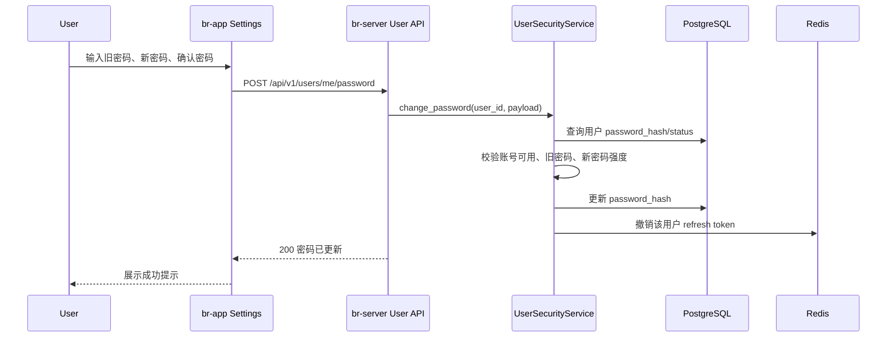
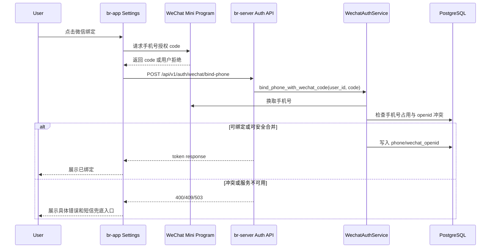
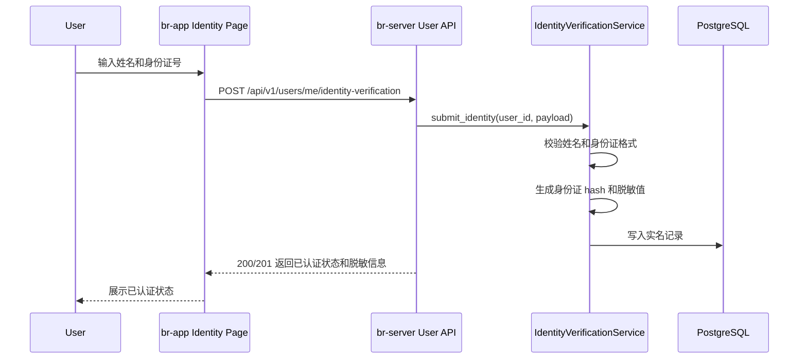
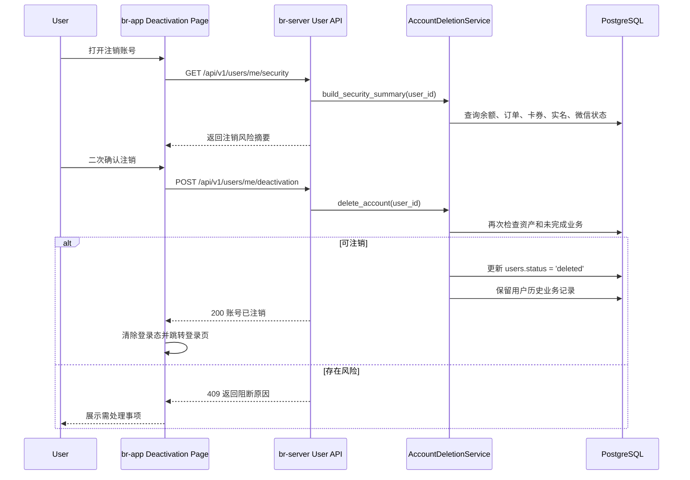

## Context

`br-app/src/pages/settings/index.vue` 已有“账号与安全”分组，但修改密码、微信绑定、实名认证、注销账号仍是占位提示。后端已有统一 `users` 表、手机号/用户名密码登录、微信快速登录、微信手机号绑定、当前用户资料更新和 JWT token 服务，可复用现有 `api/routes -> services -> models -> schemas` 分层。

本次变更跨越小程序设置页、当前用户 API、认证服务、用户模型和数据库迁移。设计目标是在不引入第三方实名核验依赖的前提下，先建立完整的账号安全闭环和后续扩展边界。

## Goals / Non-Goals

**Goals:**

- 将设置页“账号与安全”四个入口从占位变为可操作流程。
- 提供当前用户账号安全摘要，供前端展示微信绑定、实名、注销等状态。
- 支持已登录用户修改密码，校验旧密码并安全处理错误提示。
- 支持设置页发起微信绑定，复用现有微信手机号授权和短信兜底绑定能力。
- 支持实名认证资料提交、脱敏展示和状态查询。
- 支持注销账号，并基于余额、未完成订单、未用卡券等风险阻断；校验通过后设置 `users.status='deleted'`，不新增注销表也不物理删除用户。
- 保留后续接入外部实名核验和后台审核的扩展空间。

**Non-Goals:**

- 不接入公安/支付机构等外部实名核验供应商。
- 不做后台实名审核页面。
- 不自动清除或迁移用户余额、订单、卡券等资产。
- 不改变现有登录、注册、微信快速登录的主流程。
- 不实现管理员代客注销。

## Decisions

### 1. 账号安全 API 放在当前用户边界内

新增或扩展 `/api/v1/users/me/security` 系列接口，而不是放入 admin 或公共 auth 路由：

- `GET /api/v1/users/me/security`：账号安全摘要。
- `POST /api/v1/users/me/password`：修改密码。
- `POST /api/v1/users/me/identity-verification`：提交实名认证资料。
- `POST /api/v1/users/me/deactivation`：申请注销账号。

理由：这些操作都以“当前登录用户本人”为主体，权限边界与 `users/me` 一致，避免把用户自助安全功能混入后台管理或登录注册接口。

替代方案：放在 `/api/v1/auth/*`。缺点是 auth 路由已有注册、登录、刷新 token、微信登录职责，继续扩张会让 current-user 资料和安全状态分散。

### 2. 实名认证采用独立记录表

新增 `user_identity_verifications` 表，存储 `user_id`、真实姓名、身份证号哈希、身份证号脱敏值、状态、提交时间、审核时间等字段。`users` 表只保留必要的汇总字段或通过 service 查询最新记录。

理由：实名信息敏感且有生命周期，独立表便于后续接入外部核验、审核记录、重新提交和数据留存策略。身份证原文不落库，仅保存哈希和脱敏值。

替代方案：直接在 `users` 表加 `real_name`、`id_card_number`。缺点是敏感字段扩散到用户主表，后续审计和迁移成本更高。

### 3. 注销账号直接设置 `status='deleted'`，不新增表也不物理删除

注销账号不新增申请表，也不物理删除 `users` 记录。申请前由 service 统一检查风险：

- 钱包余额必须为 0。
- 不存在待支付、已确认、进行中等未完成预约。
- 不存在未使用或有效期内卡券。
- 不存在待处理退款/支付订单。

通过检查后将 `users.status` 更新为 `deleted`，撤销 refresh token，并拒绝后续登录、刷新会话或敏感操作。用户历史订单、钱包流水、核销记录等继续保留审计关联。

理由：系统有预约、钱包、卡券等资产域，物理删除会破坏审计和资金安全；本期没有后台注销审核和冷静期需求，新增注销表会增加不必要的数据流和状态同步成本。`status='deleted'` 与现有用户状态模型一致，最小化迁移范围。

替代方案：新增注销申请表并设置 `deactivation_requested`。缺点是本期不做审核/冷静期，申请表会变成单步操作的重复状态源。另一个替代方案是物理删除用户，因会破坏历史业务关联而不采用。

### 4. 修改密码成功后保留当前 access token，刷新 refresh session

修改密码要求旧密码正确、新密码符合注册密码强度。成功后更新 `password_hash`，撤销该用户旧 refresh token，并返回简洁成功响应。当前 access token 可继续用到自然过期，前端提示用户密码已更新。

理由：实现成本低，符合现有 15 分钟 access token 生命周期；撤销 refresh token 能阻断其他设备长期会话。

替代方案：立即签发新 token 并强制当前端重登。安全性略高，但前端状态处理复杂，且当前需求没有多端会话管理页面。

### 5. 前端以当前设置页为主，复杂操作用独立页面或底部弹层

保留现有设置页视觉语言：浅灰背景、白色圆角卡片、紧凑列表行、右侧状态文本和箭头。四个入口行为：

- 修改密码：进入密码表单页或设置页内安全弹层，包含旧密码、新密码、确认密码。
- 微信绑定：已绑定展示“已绑定”，未绑定调用现有微信手机号授权底部弹层和短信兜底。
- 实名认证：进入实名表单页，展示姓名、身份证号、提交后状态。
- 注销账号：进入风险说明页，先调用风险预检，再二次确认执行注销。

理由：设置页已承载多个分组，四个安全流程都需要表单/说明/错误反馈，独立页面或弹层能避免把主设置页变成长表单。

## Sequence Diagrams

### 修改密码

### 微信绑定

### 实名认证

### 注销账号

## Risks / Trade-offs

- [Risk] 实名资料属于敏感信息，误存身份证原文会扩大泄露风险 → 仅保存 hash 和脱敏号，schema 和测试明确禁止返回完整证件号。
- [Risk] 注销账号可能影响钱包、预约、卡券账务一致性 → 本期只允许“无资产风险”账号注销，存在风险返回 409 和阻断原因；注销后仅设置 `status='deleted'`，保留历史业务记录。
- [Risk] 修改密码后旧 access token 在短时间内仍有效 → 保持 15 分钟短 TTL，并撤销 refresh token；后续多端会话管理可进一步立即拉黑 access token。
- [Risk] 微信绑定冲突规则复杂，可能误合并资产账号 → 复用现有临时微信用户合并约束，非临时账号和有资产账号不自动合并。
- [Risk] 前端安全流程过多导致设置页复杂 → 主设置页只展示状态摘要，表单和说明放入独立页面/弹层。

## Migration Plan

1. 新增 Alembic 迁移，创建实名记录表，并给 `users.status` 约束增加 `deleted` 状态。
2. 后端先发布新增 API，保持旧设置页占位可继续运行。
3. 前端接入账号安全摘要接口，再逐步替换四个占位入口。
4. 发布后用 API 集成测试和小程序 H5/微信开发者工具验证四个流程。
5. 回滚时先隐藏前端入口，再回滚后端路由；实名认证表可保留以避免数据丢失，必要时执行 Alembic downgrade 移除实名结构和 `deleted` 状态约束变更。

## Resolved Decisions

- 实名认证提交后本期状态直接为 `verified`，因为没有后台审核页面或外部核验供应商。
- 注销账号本期不需要短信验证码二次确认，使用登录态 + 风险检查 + 二次确认弹层；后续如增加高风险策略再引入验证码。
- 微信绑定入口文案保留为“微信绑定”，状态说明中解释绑定手机号用于账号找回、订单通知和余额安全校验。
- 注销账号不新增申请表、不物理删除用户；风险检查通过后设置 `users.status='deleted'`。
