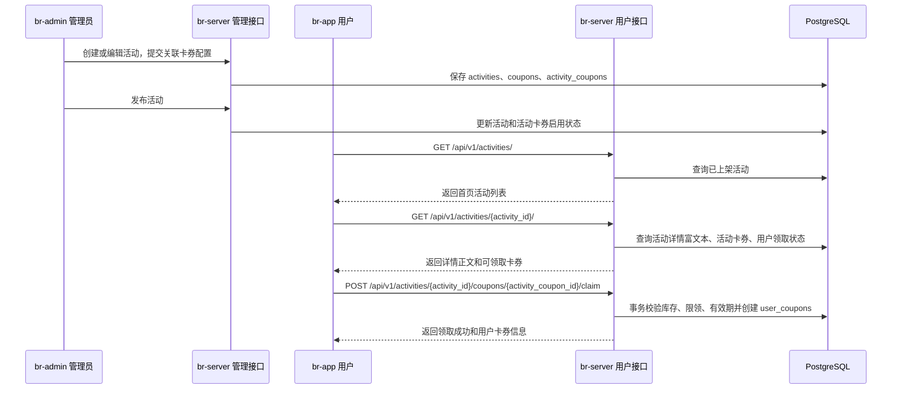

## Context

项目已有活动管理、首页活动展示、卡券模板、用户卡券和预约用券基础能力。当前缺口在于活动与卡券之间没有运营配置关系：管理员发布活动时不能同步配置发放卡券，用户从首页活动进入后也没有活动详情和领券链路。

本次设计将“活动卡券”作为活动运营配置，而不是新建一套独立卡券系统。后端继续复用现有 `coupons` 和 `user_coupons` 规则，新增活动与卡券模板之间的发放配置，用于表达活动内可领取哪些卡券、库存多少、每人限领多少张、发放有效期和展示状态。前端 br-admin 负责配置，br-app 负责活动详情展示和领取。

## Goals / Non-Goals

**Goals:**

- br-admin 可以在活动创建、编辑、发布流程中配置关联卡券。
- br-server 可以返回活动详情和活动卡券列表，并在用户领券时完成强校验。
- br-app 首页热门活动卡片可以跳转活动详情页，用户可在详情页领取卡券。
- 活动详情页支持展示运营配置的富文本正文，用于承载活动规则、图文说明和使用须知。
- 领取成功的卡券进入用户卡券包，并复用既有有效期、状态、预约使用和过期判断规则。
- 保持不关联卡券的普通活动兼容现有展示与管理流程。

**Non-Goals:**

- 不实现复杂营销规则引擎，例如满赠叠加、多券同用、用户分群投放或分享裂变。
- 不改变现有预约场景的一单一券规则。
- 不强制迁移历史活动数据；历史活动默认没有关联卡券。
- 不在本次变更中新增管理员卡券模板库管理页面，活动内卡券配置直接复用或创建所需卡券模板。
- 不实现完整 CMS 能力，例如多版本内容、定时发布正文、富文本组件模板库或复杂页面搭建。

## Decisions

### 1. 使用活动卡券配置表连接活动与卡券模板

新增 `activity_coupons` 表，关联 `activities.id` 与 `coupons.id`，并保存活动发放维度字段：`total_quantity`、`claimed_quantity`、`per_user_limit`、`claim_starts_at`、`claim_ends_at`、`is_active`、`sort_order`、`display_title`、`display_description`。领取后在 `user_coupons` 中记录 `source_type=activity`、`source_activity_id`、`source_activity_coupon_id`。

选择原因：卡券模板仍表达优惠规则和使用规则，活动卡券配置只表达“这场活动如何发放”。这样不会复制优惠计算逻辑，也便于后续统计活动领券效果。

替代方案：把活动卡券规则全部写入活动 JSON 字段。该方案迁移简单，但查询、库存并发控制、审计和后续统计都更弱，因此不采用。

### 2. 领券由后端事务内完成库存和限领校验

`POST /api/v1/activities/{activity_id}/coupons/{activity_coupon_id}/claim` 在同一事务内校验活动已上架、活动卡券启用、领取时间有效、卡券模板启用、库存未耗尽、当前用户领取数量未超过限制，然后创建 `user_coupons` 并增加 `claimed_quantity`。

选择原因：库存和限领是资产类规则，必须由后端强制执行。前端展示领取状态只用于提升体验，不能作为可信判断。

替代方案：前端根据活动详情中的余量禁用按钮。该方案仍会保留为体验优化，但不能替代后端事务校验。

### 3. 活动详情作为 br-app 领券入口

新增 `GET /api/v1/activities/{activity_id}/` 返回活动详情、富文本正文、关联卡券列表、剩余库存、当前登录用户领取状态和可领取状态。未登录用户也能查看活动详情，但领取时必须登录。

选择原因：首页活动区域保持轻量，详情页承载活动内容和领券动作，更符合移动端信息层级，也避免首页卡片承担过多交互。

替代方案：在首页活动卡片直接领取。该方案路径短，但会让首页复杂化，并且无法充分展示卡券规则和活动说明，因此不采用。

### 4. 活动详情正文使用受控富文本

在 `activities` 增加 `content_html` 字段保存活动详情富文本正文。br-admin 活动表单提供富文本编辑器，提交前保留基础排版、图片、链接、列表和强调样式；br-server 保存前做安全清洗，过滤脚本、事件属性和不允许的标签；br-app 活动详情页使用小程序安全富文本渲染能力展示正文。

选择原因：活动详情需要承载运营规则和图文说明，普通 `description` 字段只适合摘要，不足以表达完整活动内容。将富文本正文放在活动模型上，可以和活动上下架、卡券配置保持同一生命周期。

替代方案：继续使用纯文本描述。该方案实现最小，但无法满足图文活动详情需求，因此不采用。另一个替代方案是外链 H5 活动页，灵活性更高，但会引入额外发布链路和小程序跳转兼容成本，本次不采用。

### 5. br-admin 活动表单内配置卡券

活动创建/编辑弹窗增加“关联卡券”区域，支持新增、删除、启停和排序卡券配置。发布活动时，启用状态的活动卡券随活动一起对用户可见；保存草稿或下架活动时，客户端不提供领取入口。

选择原因：运营人员在同一个活动上下文里完成内容和权益配置，减少跨页面配置出错。

替代方案：独立“活动卡券管理”页面。该方案适合复杂活动，但本次范围内会增加不必要导航和状态同步成本。

### 6. UI 风格沿用现有原型和项目组件

br-app 活动详情参考 `prototype/home.html` 的首页活动视觉和 `prototype/coupon.html` 的卡券样式；br-admin 沿用现有活动管理表格、弹窗、Naive UI 表单样式和项目内已有编辑控件。

## Sequence

## Risks / Trade-offs

- [并发领券导致超发] → 在数据库事务中锁定活动卡券配置行，更新 `claimed_quantity` 时校验库存。
- [用户重复请求导致重复领券] → 使用用户、活动卡券、来源维度的领取数量校验，并对每人限领规则做后端强校验。
- [活动下架后用户已领卡券是否可用存在争议] → 已领取卡券继续按卡券自身有效期和使用规则可用；下架只阻止继续展示和领取。
- [活动卡券配置和卡券模板字段边界不清] → 优惠金额、折扣、门槛、适用范围、卡券有效期归属 `coupons`；库存、限领、领取窗口、活动展示文案归属 `activity_coupons`。
- [富文本内容存在脚本注入风险] → 后端保存前清洗富文本，只允许白名单标签和属性；小程序端使用安全渲染组件，不执行脚本。
- [前端状态和后端状态短暂不一致] → 领取接口返回权威状态，失败时显示后端错误，并刷新活动详情。

## Migration Plan

1. 新增 alembic 迁移，为 `activities` 增加 `content_html` 字段，创建 `activity_coupons` 表，并为 `user_coupons` 增加来源活动字段。
2. 后端先发布兼容代码：活动详情在无活动卡券时返回空数组，现有活动列表保持兼容。
3. br-admin 发布活动卡券配置 UI，允许运营为新活动配置关联卡券。
4. br-app 发布活动详情和领券入口。
5. 更新 `docs/api.md`，补充活动详情、活动领券和管理端活动卡券字段。

回滚时优先关闭 br-app 领券入口和后端领券路由；已有用户卡券不删除，避免影响用户资产。若需要数据库回滚，仅在确认无生产领券数据依赖新增字段后执行迁移回退。

## Resolved Questions

- 活动卡券领取窗口是否默认等于活动展示窗口：本提案默认可以独立配置，未配置时跟随活动上下架状态。
- 活动详情正文是否需要富文本：已确认需要富文本，纳入本次变更范围。后台维护 `content_html`，后端进行安全清洗，小程序活动详情页渲染富文本正文。
