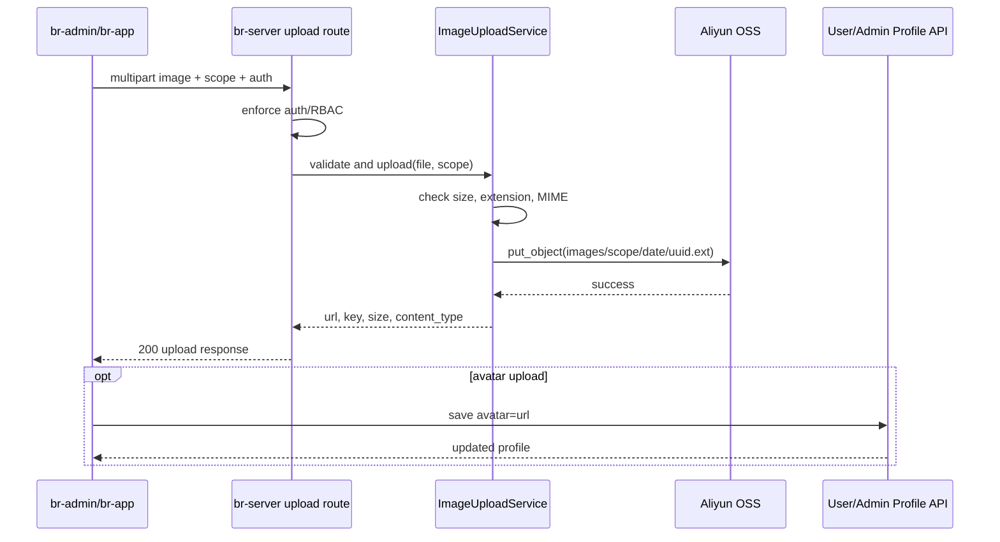

## Context

现有后端提供 `POST /api/v1/admin/upload`，在 `br-server/app/api/routes/upload.py` 中校验扩展名和 5MB 大小后写入本地 `uploads/YYYY/MM/DD/<uuid>.<ext>`，再返回 `/uploads/...` 相对路径。br-admin 的活动封面和自习室封面已经通过 Naive UI `n-upload` 调用该接口，但自习室模块复用了 `@/api/activity` 的 `uploadFile`，说明上传客户端还没有抽成共享能力。br-admin 的账号头像和系统用户头像仍以 URL 输入为主。br-app 用户资料存在 `avatar` 字段，但没有统一图片上传客户端。

本次改造跨后端、br-admin、br-app 和外部阿里 OSS，因此需要明确统一架构、权限边界和回滚策略。

## Goals / Non-Goals

**Goals:**

- 后端使用阿里 OSS 保存图片，生产环境返回配置的 CDN/自定义域名公开 URL。
- 后端统一图片校验：扩展名、MIME、文件大小、空文件和 OSS 配置缺失错误。
- br-admin 所有业务图片上传入口使用共享上传 API 客户端，不再由活动模块承担通用上传职责。
- br-app 头像上传使用小程序图片选择和统一上传 API，上传成功后保存到用户资料。
- 所有上传凭据保留在服务端，不向 br-app 或 br-admin 暴露 AccessKey Secret。
- 保留本地上传降级配置，便于开发环境和线上回滚。

**Non-Goals:**

- 不实现图片裁剪、压缩、水印、鉴黄或内容审核。
- 不迁移历史数据库中已有的 `/uploads/...` 或外部图片 URL。
- 不做 OSS Bucket/CDN 的控制台创建和域名备案工作，只提供应用侧配置和接入。
- 不改造 demo/示例页面中与真实业务无关的上传演示，除非其复用会影响生产构建。

## Decisions

### Decision 1: 服务端中转上传到 OSS

后端接收 multipart 文件并用服务端 OSS 凭据上传，而不是让前端直传 OSS。

理由：
- 现有 br-admin 已经是服务端上传接口，改造成本低。
- 可以继续在后端强制 RBAC、用户认证、大小和类型校验。
- 不需要把 AccessKey Secret、Policy 或 STS 逻辑暴露给多个前端。

备选方案：
- 前端直传 OSS：性能更好，但需要 STS/Policy、回调校验和更多安全边界，当前业务图片体积较小，收益不足。
- 保持本地上传：部署扩展性和可用性不足，不能满足本次目标。

### Decision 2: 增加共享上传服务和存储后端抽象

后端新增 `ImageUploadService`，内部根据 `UPLOAD_STORAGE_DRIVER=oss|local` 选择 OSS 或本地实现。API 路由只负责认证、接收文件和调用服务，不写存储细节。

理由：
- 支持生产环境使用 OSS，开发环境或回滚使用 local。
- 单元测试可通过 fake storage 验证 key、URL、错误映射。
- 保持 Clean Architecture，避免路由处理器膨胀。

### Decision 3: OSS object key 使用业务前缀和日期分区

对象 key 采用 `images/{scope}/YYYY/MM/DD/{uuid}.{ext}`。`scope` 由上传接口或前端调用点传入受控枚举，例如 `activity-cover`、`room-cover`、`avatar`、`common`。

理由：
- 便于 OSS 生命周期管理和排查。
- 避免用户提供路径造成覆盖或目录穿越。
- 保留 UUID 防冲突。

### Decision 4: 生产访问使用 CDN/自定义域名公开读

OSS Bucket 不直接作为前端依赖域名，生产环境统一通过 `OSS_PUBLIC_BASE_URL` 返回 CDN 或自定义域名 URL。Bucket 访问权限由运维配置为适合 CDN 回源的模式；应用侧只负责上传对象并拼接公开访问 URL。开发和回滚场景可切换到 `local`，返回 `/uploads/...`。

理由：
- br-app 和 br-admin 只依赖稳定公开图片域名，不耦合 OSS 内部 Endpoint。
- 后续可通过 CDN 做缓存、HTTPS 证书和小程序合法域名配置。
- 不要求本次应用代码管理 Bucket 权限策略。

备选方案：
- 直接使用 OSS 公网域名公共读：接入更简单，但域名治理和后续 CDN 切换成本更高。
- 私有 Bucket 签名 URL：安全性更强，但头像、封面、活动图属于公开展示资源，签名过期会增加前端复杂度。

### Decision 5: 保留 admin 上传入口，新增 app 上传入口

- br-admin 继续使用 `POST /api/v1/admin/upload`，权限仍为 `upload:create`。
- br-app 使用 `POST /api/v1/upload/image` 或等价认证用户上传入口，依赖用户登录态。
- 两个入口共用同一个服务、校验和响应 Schema。

理由：
- 保持 br-admin 兼容，不破坏现有活动/自习室上传调用。
- br-app 不能依赖 admin 权限，也不应调用 admin 路由。

### Decision 6: 按业务 scope 设置大小限制

默认图片大小上限为 5MB。头像类 `avatar` scope 上限为 2MB；封面类 `activity-cover`、`room-cover` 和通用图片 `common` 上限为 5MB。后端是最终限制来源，前端可提前提示但不能替代后端校验。

理由：
- 头像通常用于列表和资料卡，2MB 足够并能降低移动端流量。
- 封面图需要更高质量，保留现有 5MB 行为降低兼容风险。
- scope 维度比接口维度更清晰，admin/app 可复用同一上传服务。

### Decision 7: br-admin 抽出通用上传 API

新增 `br-admin/src/api/upload`，活动、自习室、账号头像和用户头像表单都调用该模块。活动模块中的 `uploadFile` 只保留兼容导出或迁移删除。

理由：
- 避免自习室上传继续从 `@/api/activity` 引入。
- 让后续新增 banner、优惠券图片等入口自然复用。

### Decision 8: br-app 本次只实现头像上传

br-app 本次只实现用户头像上传。实现阶段仍需要搜索 br-app 是否存在其他生产图片上传入口；若没有，不新增其他上传 UI。未来新增小程序图片上传能力时必须复用同一上传客户端。

理由：
- 当前已识别的 br-app 图片写入字段是用户 `avatar`。
- 避免为了“全量关联”引入不存在的业务入口。

### Decision 9: br-app 头像上传绑定用户资料保存

br-app 设置页头像区域支持选择图片、调用统一上传 API、获得 OSS URL 后调用用户资料更新接口保存 `avatar`，并刷新 Vuex 用户信息。

理由：
- 单纯上传文件不等于用户头像变更，必须和资料更新串起来。
- 失败时可以停留在原头像，避免显示本地临时路径。

### Sequence Diagram

## Risks / Trade-offs

- OSS 配置缺失导致线上无法上传 → 启动时记录配置状态，上传时返回明确错误；保留 `UPLOAD_STORAGE_DRIVER=local` 回滚。
- OSS URL 域名未加入小程序合法域名 → 上线前将 `OSS_PUBLIC_BASE_URL` 对应 CDN/自定义域名加入微信小程序 download/upload 合法域名。
- 伪造扩展名绕过校验 → 同时校验扩展名、Content-Type 和文件头基础签名。
- 前端仍有散落 URL 输入或旧上传 API → 通过 `rg` 清点上传入口，任务中逐一替换并保留回归检查。
- 服务端中转上传占用内存 → 按 scope 限制图片大小，头像 2MB、封面/通用 5MB；后续大文件再设计直传。
- OSS 上传成功但资料保存失败 → 前端提示保存失败并不更新页面头像；孤立 OSS 对象通过生命周期规则清理。

## Migration Plan

1. 增加 OSS 配置项和 `.env.example` 文档：Endpoint、Bucket、AccessKey、Secret、`OSS_PUBLIC_BASE_URL`、Storage Driver。
2. 实现 OSS 上传服务和本地降级实现，更新 admin/app 上传路由共用服务。
3. 更新 br-admin 通用上传 API，并替换活动封面、自习室封面、账号头像和系统用户头像上传入口。
4. 更新 br-app 用户头像上传入口和用户资料保存流程。
5. 更新 `docs/api.md` 和相关 OpenSpec 主规格。
6. 在测试环境配置 OSS 或 mock OSS，运行后端单元/接口测试和前端构建。
7. 生产发布前确认 Bucket 回源权限、CORS、CDN/自定义公开域名、小程序合法域名。

回滚方案：
- 将 `UPLOAD_STORAGE_DRIVER` 切回 `local` 并重启服务，上传恢复到本地 `uploads/`。
- 前端仍调用同一 API，无需回滚前端。
- 已保存的 OSS URL 继续可读；如果 OSS 故障，需要恢复 OSS/CDN 服务或批量替换业务数据中的图片 URL。

## Resolved Questions

- OSS 公开访问方式：生产环境使用 CDN/自定义域名公开读，应用通过 `OSS_PUBLIC_BASE_URL` 返回公开 URL，不直接依赖 OSS 内部 Endpoint。
- br-app 范围：本次只实现用户头像上传；实现阶段继续扫描其他生产上传入口，若不存在则不新增额外上传 UI。
- 文件大小限制：按 scope 区分，`avatar` 为 2MB，`activity-cover`、`room-cover`、`common` 为 5MB。
