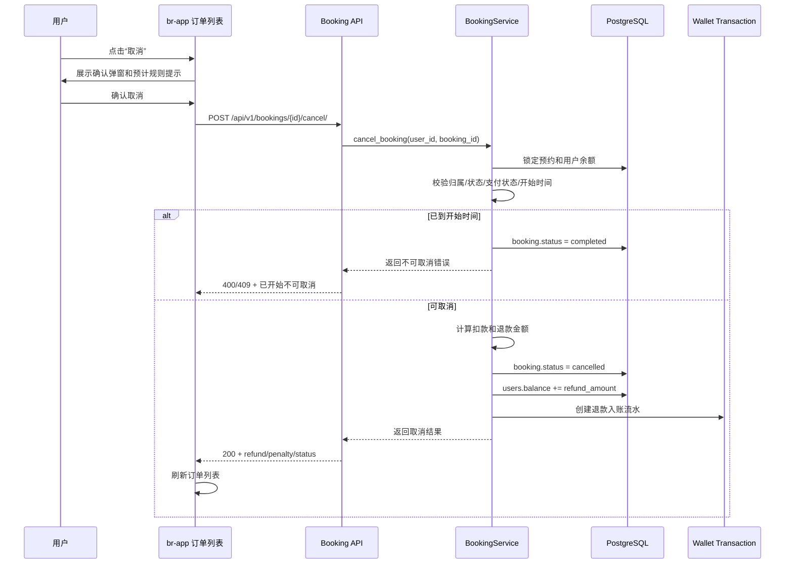

## Context

当前预约系统已支持用户创建预约、查看订单、查看座位，以及基础取消接口；支付链路已支持余额/微信支付，钱包已有余额和流水查询。新的取消预约需求跨越 br-app 订单列表、br-server 预约服务、支付/钱包结算和订单状态维护：用户需要在“已确认”订单行内取消预约，系统需要按距离预约开始时间分档扣费，并将剩余金额退回钱包且生成流水。

关键约束：
- 取消和退款必须在后端强制执行，前端仅负责展示入口和确认交互。
- 订单金额、扣费金额、退款金额必须以 Decimal 计算并在数据库事务内更新，避免浮点误差和并发重复退款。
- 预约开始时间点及之后不可取消，并应转为已完成。

## Goals / Non-Goals

**Goals:**
- 在订单列表“查看座位”右侧提供“取消”按钮。
- 后端提供幂等、安全的取消预约流程，校验订单归属、状态、支付状态和预约开始时间。
- 按取消时间距离预约开始时间分档计算扣款比例和退款金额。
- 取消成功后订单状态变为 `cancelled`，退款进入钱包，并产生可在钱包流水中查询的入账记录。
- 到达预约开始时间点及之后，已确认订单不可取消，并转为 `completed`。

**Non-Goals:**
- 不实现管理员代客取消或后台审核流程。
- 不接入微信原路退款；本次所有可退金额统一退回用户钱包。
- 不支持部分取消、改期、取消原因采集或优惠券复杂补偿策略以外的新营销能力。

## Decisions

### Decision 1: 后端以预约开始时间作为唯一扣费基准

使用 `booking.date + booking.start_time` 组合成预约开始时间，和服务端当前时间比较。扣费比例按剩余时间分档：
- `remaining > 48h`：扣 0%。
- `24h < remaining <= 48h`：扣 10%。
- `2h < remaining <= 24h`：扣 20%。
- `0 < remaining <= 2h`：扣 50%。
- `remaining <= 0`：不可取消，订单转为 `completed`。

选择该方案是因为规则与用户描述完全一致，且避免前端时区/设备时间影响。替代方案是前端预计算可退金额，但会带来篡改和展示不一致风险。

### Decision 2: 取消、余额退款、钱包流水写入使用同一数据库事务

取消服务在事务内锁定预约记录和用户余额记录，计算 `penalty_amount` 与 `refund_amount`，更新预约取消字段、增加用户余额、创建钱包入账流水。若任何一步失败，事务回滚，订单保持原状态。

替代方案是先取消订单后异步退款；该方案会出现“订单已取消但退款失败”的中间态，不适合当前没有补偿任务和客服后台的系统。

### Decision 3: 退款统一写入钱包流水，数据库类型为 `booking_refund`

本次不做微信原路退款，微信支付订单也退回钱包。取消退款流水在数据库中 MUST 使用独立类型 `booking_refund`，钱包流水中展示为“取消退款”，方向为 `income`，状态为 `completed`。

替代方案是复用 `recharge` 类型；虽然用户提出“生成一条钱包充值流水记录”，但业务语义上这是取消退款。使用 `booking_refund` 能避免财务统计把退款混入用户主动充值，同时仍在钱包流水中按入账记录展示，并保留关联 booking_id 以便审计。

### Decision 4: 订单完成状态采用取消接口内懒更新 + 可选定时任务

取消接口遇到已到开始时间的 confirmed 订单时，应先将其转为 `completed` 并拒绝取消。列表接口或已有清理任务也可复用同一状态同步逻辑，保证用户不点击取消时订单最终也会显示为已完成。

替代方案是只依赖定时任务；但定时任务延迟会让用户在开始时间后仍看到取消按钮，造成规则冲突。

### Cancellation flow

## Risks / Trade-offs

- [Risk] 并发重复点击取消导致重复退款 → Mitigation: 服务层对 booking 行加锁，并要求仅 `confirmed` 且未取消的订单进入退款分支；重复请求返回已取消状态或业务错误，不再次入账。
- [Risk] 金额四舍五入产生分歧 → Mitigation: 使用 Decimal，以分为最小单位或 `quantize(Decimal("0.01"))` 统一保留两位。
- [Risk] 到点完成逻辑只在取消接口触发会导致列表状态滞后 → Mitigation: 列表查询或后台清理任务复用 `sync_completed_bookings`，取消接口仍做最后防线。
- [Risk] 钱包流水类型扩展影响旧前端筛选 → Mitigation: 查询 API 支持 `booking_refund`；旧的 `type=all` 正常返回，新类型字段有稳定 title/direction/status。
- [Risk] 微信支付退款回钱包可能不符合用户对“原路退款”的预期 → Mitigation: 前端确认弹窗和结果提示明确“退回钱包余额”。

## Migration Plan

1. 新增数据库迁移：为预约表补充取消审计字段（如 `cancelled_at`、`penalty_amount`、`refund_amount`、`cancel_policy`），为钱包流水补充/允许 `booking_refund` 类型和 booking 关联字段（如需要）。
2. 部署后端服务：新增或强化取消接口、状态同步、退款事务和钱包流水映射。
3. 部署 br-app：订单列表新增取消按钮、确认弹窗、取消 API 调用和列表刷新。
4. 回滚：前端隐藏取消按钮；后端保留字段和流水读取兼容，必要时禁用取消路由或让路由返回维护提示。已产生的取消和退款流水不回滚删除。

## Resolved Decisions

- 取消退款流水在数据库中命名为 `booking_refund`。
- 钱包流水中 `booking_refund` 展示标题为“取消退款”。
- 若订单使用优惠券，取消后继续恢复优惠券，沿用现有取消接口约定。
