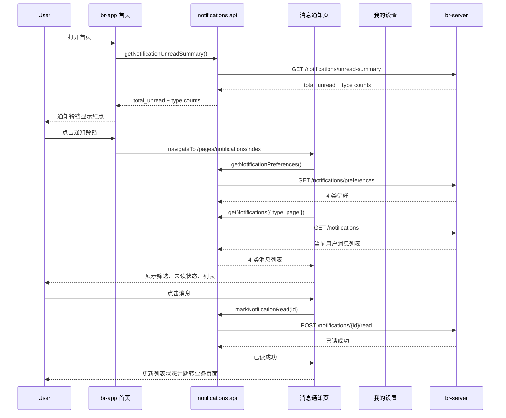

## Context

br-app 已有首页通知铃铛和“我的设置”中的通知设置分组，但首页铃铛当前不跳转，设置页 4 类通知开关也未与消息展示能力联动。用户需要一个移动端消息通知中心，用于查看预约、活动、学习报告和到店提醒 4 类消息，并与设置页偏好保持一致。

现有 br-app 采用 pages/api/utils 分层，首页与设置页均为页面级 Vue SFC。当前没有消息通知 API 封装，也没有消息中心页面路由。该变更同时纳入 br-server REST 后端接口，前端通过 api 层访问真实接口，后端负责当前用户消息、未读摘要、已读状态和通知偏好。

## Goals / Non-Goals

**Goals:**

- 新增消息通知页面，支持 4 类通知：预约提醒、活动通知、学习报告、到店提醒。
- 首页通知铃铛进入消息通知页面，并用未读红点表达 unread 状态。
- 设置页通知设置保留并明确 4 类开关，与消息通知页面类型一致。
- 消息通知页面提供类型筛选、未读/已读展示、空状态、加载、刷新、错误重试。
- 前端通过 `src/api/notifications.js` 封装数据读取和状态更新，避免页面直接写死数据来源。
- br-server 提供通知列表、未读摘要、单条已读、批量已读、偏好读取和偏好更新 REST API。
- br-server 保证所有通知和偏好接口只访问当前登录用户的数据。

**Non-Goals:**

- 不实现微信订阅消息授权、模板消息发送或推送服务端投递。
- 不实现复杂消息详情页；V1 仅支持列表内摘要和按业务类型跳转到已有页面。
- 不实现管理后台消息配置。
- 不改变后端 RBAC 或现有用户设置接口之外的安全策略。
- 不实现复杂事件总线；V1 只提供 `create_notification(...)` 服务方法供未来业务生产者调用。

## Decisions

### D1. 通知类型与设置开关使用同一枚举

使用 `booking`、`activity`、`report`、`arrival` 作为前端通知类型键，对应设置页 4 类开关。

备选方案是页面间各自维护 label 和 key，但会导致文案、筛选和偏好不同步。统一枚举可让首页红点、通知列表筛选、设置开关共用同一配置。

### D2. 消息通知页面作为独立 page，而不是首页弹层

新增 `pages/notifications/index` 页面，由首页铃铛导航进入。页面包含顶部筛选 tabs、消息列表和状态处理。

备选方案是在首页直接弹出消息面板，但首页已有 banner、快捷入口、自习室列表和活动区，弹层会增加首页状态复杂度，也不利于后续支持分页、刷新和业务跳转。

### D3. br-server 提供真实 REST API

新增 `notifications` 和 `notification_preferences` 后端模型。

`notifications` 字段包含：`id`、`user_id`、`type`、`title`、`content`、`target_url`、`target_type`、`target_id`、`is_read`、`created_at`、`read_at`。`type` 仅允许 `booking`、`activity`、`report`、`arrival`。

`notification_preferences` 字段包含：`user_id`、`booking_enabled`、`activity_enabled`、`report_enabled`、`arrival_enabled`、`updated_at`。新用户默认 4 类均开启。

后端提供以下接口，全部基于当前登录用户，不接受客户端传入 `user_id`：

- `GET /api/v1/notifications?type=&page=&page_size=`
- `GET /api/v1/notifications/unread-summary`
- `POST /api/v1/notifications/{id}/read`
- `POST /api/v1/notifications/read-all`
- `GET /api/v1/notifications/preferences`
- `PUT /api/v1/notifications/preferences`

新增 `br-app/src/api/notifications.js` 封装这些接口，页面不得直接拼接请求路径。

### D4. 设置开关以后端偏好为准

设置页 4 类开关通过 `GET /api/v1/notifications/preferences` 初始化，通过 `PUT /api/v1/notifications/preferences` 保存。保存失败时回滚开关状态并提示用户。

消息页读取同一偏好。关闭的类型在筛选中仍可见，允许用户查看历史消息，但展示“该类通知已关闭”提示。首页红点和未读摘要只计算已开启类型。

### D5. 未读红点由 summary 驱动

首页加载和页面显示时调用未读摘要接口，`total_unread > 0` 时展示红点。后端 unread summary 只统计用户已开启类型的未读数。进入通知页并读完消息后，返回首页应刷新红点。

### D6. 消息点击先标记已读，再按目标跳转

用户点击消息时，前端先调用单条已读接口。已读成功后，根据 `target_url` 跳转；没有 `target_url` 时按类型使用默认目标：

- `booking`: 预约/订单列表或详情页。
- `activity`: 首页活动入口。
- `report`: 学习记录页面。
- `arrival`: 我的学习码页面。

标记已读失败时，消息保持未读状态并展示 toast，不执行跳转。

## Flow

## Risks / Trade-offs

- [Risk] 新增后端模型和迁移扩大变更范围。 -> REST 接口保持最小闭环，不引入推送、模板消息或事件总线。
- [Risk] 设置页保存失败导致 UI 与后端偏好不一致。 -> 保存失败回滚本地开关并 toast 提示。
- [Risk] 首页红点频繁请求影响首页加载。 -> 首页只请求轻量 unread summary，并与现有 `loadData()` 并行执行。
- [Risk] 关闭某类通知后用户仍可能需要查看历史消息。 -> 设置关闭不删除历史消息；消息页类型筛选仍允许查看，但显示关闭提示。
- [Risk] 跨用户读取通知会泄露隐私。 -> 所有查询都从当前登录用户派生 `user_id`，单条已读和批量已读均限定当前用户。

## Migration Plan

1. 新增 br-server 通知和通知偏好模型、数据库迁移。
2. 新增 br-server schema、service、router 和测试。
3. 更新 `docs/api.md` 记录通知 REST API。
4. 新增 br-app 通知 API 封装和类型配置。
5. 新增消息通知页面和路由。
6. 首页铃铛接入 unread summary 和页面跳转。
7. 设置页通知开关改为后端偏好读取/保存，并与通知类型配置一致。
8. 构建验证 `pnpm run build:h5`，后端运行相关测试。

回滚策略：删除新增页面和 API 封装，首页 `onTapBell` 恢复占位，设置页保留原本本地状态；后端回滚新增通知路由、service、schema、模型和迁移。

## Resolved Questions

- br-server 在同一变更中提供真实消息列表、未读摘要、已读状态和偏好接口，前端以真实 REST API 作为主路径。
- 消息点击行为采用“先标记已读，成功后跳转”：优先使用 `target_url`，缺失时按类型跳转到预约/活动/学习记录/学习码等已有页面。
