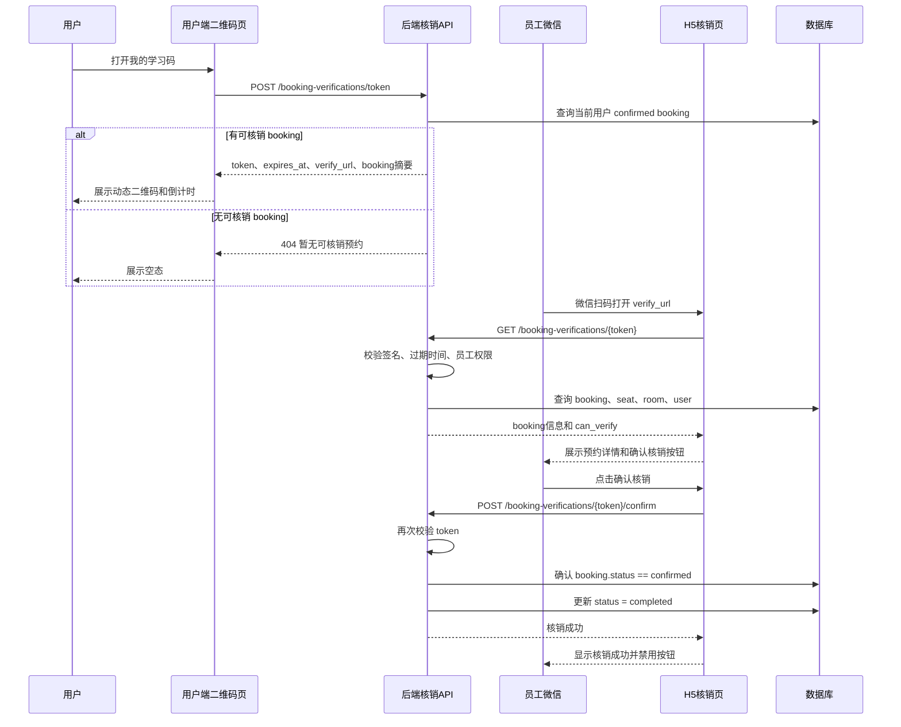

## Context

移动端 `br-app` 已有个人中心页面和学习记录页面，使用 uni-app + Vue，页面样式以 rpx、SCSS 变量和单文件页面为主。`prototype/qrcode.html` 已给出“我的学习码”的高保真视觉结构：顶部导航、用户头像/昵称/VIP 徽章、二维码卡片、会员信息卡片、安全提示和底部操作区。

后端 `br-server` 已有 booking 领域模型和普通用户 booking API。`Booking.status` 当前支持 `confirmed`、`cancelled`、`completed`，但只有创建、列表、详情和取消能力，没有到店核销流程。新增需求是：用户生成二维码后，门店工作人员用微信扫码打开页面，查看该用户 booking 信息，并点击“确认核销”把预约状态更新为 `completed`。

本次设计将原“纯前端个人二维码”升级为“用户出示动态核销码 + 员工扫码 H5 核销 + 后端状态变更”的闭环能力。

## Goals / Non-Goals

**Goals:**

- 新增 `/pages/qrcode/index` 用户端页面，还原 `prototype/qrcode.html` 的主要信息结构、层级和移动端视觉风格。
- 从个人中心提供“我的学习码”入口。
- 后端为当前用户可核销的 `confirmed` booking 签发 5 分钟有效 token，并返回微信扫码可打开的 H5 `verify_url`。
- 用户端二维码展示 `verify_url`，并显示倒计时、booking 摘要、刷新和错误兜底。
- 新增员工扫码 H5 核销页，展示 booking 信息并提供“确认核销”按钮。
- 后端确认核销时将 booking 从 `confirmed` 更新为 `completed`，并阻止过期、取消、已核销和无权限场景。

**Non-Goals:**

- 不新增门店端完整后台或员工账号管理 UI。
- 不新增 booking 之外的会员等级、会员有效期、会员卡数据库模型。
- 不实现离线核销；核销必须在线调用后端。
- 不把动态核销码设计为可长期保存或长期分享的会员码。

## Decisions

### 1. 采用后端签发的 5 分钟动态 token

二维码内容不由前端拼接用户 ID，而由后端签发短时 token 并返回 `verify_url`。token 绑定 booking，并携带签发时间和过期时间。实现优先使用服务端签名方案，例如 JWT 或 `itsdangerous.URLSafeTimedSerializer`，避免新增数据库表。

选择该方案是因为核销会触发 `booking.status` 状态变更，必须防伪、防篡改、防长期截图复用。替代方案是静态用户码，但它会让任何持有码的人长期查询或核销用户预约，安全边界不成立。

### 2. 用户端二维码页只负责出示码和刷新

新增 `br-app/src/pages/qrcode/index.vue`，并在 `br-app/src/pages.json` 注册路由。个人中心在“会员服务”区域增加“我的学习码”菜单项，点击后 `uni.navigateTo({ url: '/pages/qrcode/index' })`。

页面加载后调用 `POST /api/v1/booking-verifications/token` 获取 token、过期时间、`verify_url` 和 booking 摘要。页面展示二维码、倒计时、预约摘要、安全提示和刷新按钮。原型里的“保存到相册/分享给好友”不作为核心需求，因为动态码 5 分钟过期，保存和分享容易误导用户；如保留按钮，只能作为平台受限的辅助操作，并必须提示有效期。

### 3. 员工扫码打开 H5 核销页

二维码内容是一个可被微信扫一扫打开的 H5 URL，例如：

`{frontendBaseUrl}/#/pages/verify-booking/index?token=...`

新增 `br-app/src/pages/verify-booking/index.vue`。页面读取 token，要求员工/管理员登录后调用解析接口展示 booking 信息：用户、门店、座位、日期、时间段、金额、状态和是否可核销。员工点击“确认核销”后调用确认接口。成功后页面进入“核销成功”状态并禁用重复提交。

选择 H5 页面而不是小程序扫码跳转，是因为微信扫一扫打开网页最通用，不要求员工安装同一小程序或配置小程序扫码跳转规则。

### 4. 新增独立 booking verification API

新增 `booking-verification-api`，不要把核销接口混进普通用户 booking API：

- `POST /api/v1/booking-verifications/token`
  - 鉴权：普通登录用户
  - 行为：查找该用户当前可核销的 `confirmed` booking，签发 5 分钟 token
  - 返回：`token`、`expires_at`、`verify_url`、booking 摘要
  - 无可核销 booking：返回 404 或业务错误

- `GET /api/v1/booking-verifications/{token}`
  - 鉴权：员工/管理员
  - 行为：校验 token 签名、过期时间和 booking 状态
  - 返回：booking 展示信息和 `can_verify`
  - token 过期：返回 410；已核销或已取消：返回 409 或 `can_verify: false`

- `POST /api/v1/booking-verifications/{token}/confirm`
  - 鉴权：员工/管理员
  - 行为：再次校验 token 和 booking 状态，将 `confirmed` 更新为 `completed`
  - 返回：核销成功后的 booking 信息
  - 重复核销、取消 booking、过期 token 均失败

解析接口也要求员工/管理员鉴权，因为预约信息包含用户和门店消费数据，不能让任何拿到 URL 的人都能查看。

### 5. 状态流转规则

- 只有 `confirmed` booking 可以核销为 `completed`。
- `cancelled` 不可核销。
- `completed` 不可重复核销。
- token 过期后不可解析和不可核销。
- token 与 booking 绑定，不能拿 A booking 的 token 核销 B booking。
- 确认核销时后端必须重新读取 booking 并二次校验状态，不能只相信 token 解析结果。

复杂流程如下：

## Risks / Trade-offs

- [Risk] 当前系统可能还没有员工/管理员移动端登录与角色判断 → Mitigation: 复用现有认证依赖并新增/复用角色校验；如果 RBAC 数据不足，先在 tasks 中明确补齐最小员工权限依赖。
- [Risk] 无数据库 token 表时无法服务端记录 token 是否已使用 → Mitigation: 以 booking 状态作为一次性核销保护；只要 booking 变为 `completed`，旧 token 即使未过期也不能重复核销。
- [Risk] 用户可能没有当前可核销 booking → Mitigation: token 签发接口返回明确空态，用户端展示“暂无可核销预约”。
- [Risk] 动态码保存/分享会造成误解 → Mitigation: 不把保存/分享作为核心交互，优先提供倒计时和刷新。
- [Risk] H5 页面在微信里打开时登录态可能不同于用户端 → Mitigation: 员工扫码页单独做员工登录/无权限状态，不依赖用户端登录态。

## Migration Plan

1. 新增后端 booking verification schemas、service、routes 和测试。
2. 在 `br-server/app/main.py` 注册新 route。
3. 新增前端 booking verification API 封装。
4. 新增用户端二维码页和员工 H5 核销页，注册路由。
5. 修改个人中心入口。
6. 更新 `docs/api.md`。
7. 运行后端测试和前端构建/页面验证。

回滚时删除新增后端核销模块与路由注册，删除新增前端页面/API 封装，移除 `pages.json` 路由和个人中心入口，回退 `docs/api.md`。

## Resolved Questions

- **是否需要后端签发短时有效的动态二维码？** 是。token 由后端签发，5 分钟有效，绑定 booking，确认核销时再次校验。
- **会员等级、有效期、头像是否需要独立会员 API？** 本次不需要。核销展示以 booking 信息为准，用户端页面可继续使用现有用户状态和 booking 摘要展示。
- **扫码后由谁核销？** 门店工作人员/管理员核销，普通用户只负责出示二维码。
- **扫码打开什么页面？** 微信扫一扫打开 H5 核销页。
