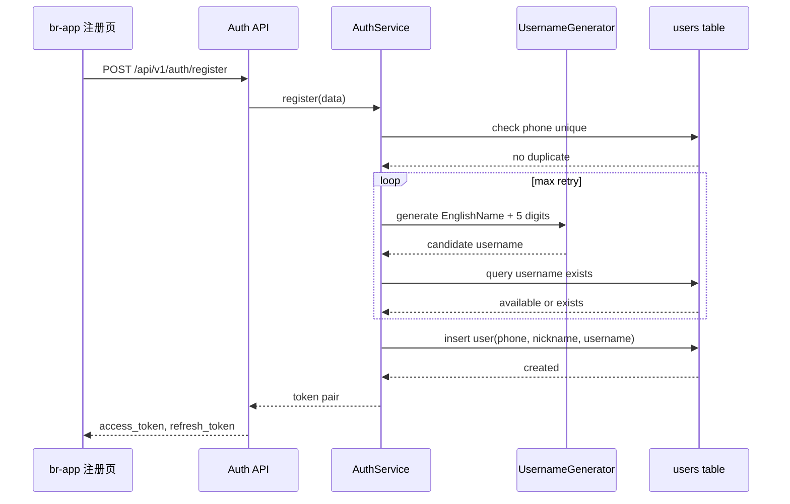
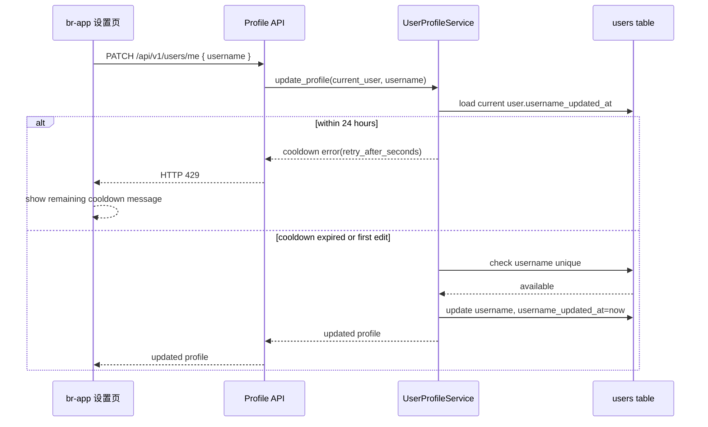

## Context

小程序已有“我的”页面入口指向 `/pages/settings/index`，但当前代码库未提供对应设置页面。`prototype/settings.html` 定义了目标视觉：移动端白底卡片、固定导航、头像资料卡、分组列表、开关项、退出登录确认弹层。

后端当前注册流程只生成默认昵称，`unified-user-model` 规格还约定 app 用户 `username` 可为空且唯一索引仅覆盖 admin 用户。此次变更会把 `username` 扩展为所有用户共享的稳定账号标识，因此需要同时处理 UI、API、注册生成、数据库唯一性与历史数据兼容。

## Goals / Non-Goals

**Goals:**

- 实现与 `prototype/settings.html` 总体风格一致的小程序设置页。
- 在个人资料中展示并编辑用户名，同时保留昵称的显示名称语义。
- 注册时由后端自动生成唯一用户名，格式为随机英文名 + 5 位随机数。
- 用户名在所有用户中全局唯一，登录和资料接口都返回 username。
- 用户名不限制总修改次数，但每次成功修改后进入滚动 24 小时冷却期。
- 对用户名生成、碰撞重试、资料更新和 UI 主流程提供测试覆盖。

**Non-Goals:**

- 不实现完整实名认证、微信绑定、语言切换、深色模式等后续业务能力；这些可先作为静态入口或禁用状态展示。
- 不改变现有手机号注册的主流程和短信验证码规则。
- 不把昵称替换为用户名，个人资料中两者并存。

## Decisions

### 1. 用户名生成放在后端注册服务

注册服务在创建用户前生成 username，并通过数据库唯一约束兜底。生成候选值时从内置英文名列表随机选择一个英文名，再拼接 `10000-99999` 的 5 位随机数，例如 `Luna48392`。

备选方案是由前端生成后提交，但无法覆盖管理端创建、第三方注册或后续新增注册入口，也不能可靠处理并发碰撞。因此用户名生成必须在后端集中实现。

复杂流程：

### 2. 用户名全局唯一，而不是按 user_type 隔离

`users.username` 对所有非空值建立全局唯一约束。这样 app 用户、admin 用户、登录查询和管理后台创建用户都使用同一套唯一性语义，避免同名账号在不同用户类型之间产生歧义。

备选方案是保留 admin-only partial unique index，并额外给 app 用户建 partial index。但当前登录规格已经支持按用户名从统一 `users` 表查询，如果不同 user_type 允许同名，会导致登录匹配不确定。

### 3. 资料编辑使用“当前登录用户 profile API”

新增或扩展 `/api/v1/users/me` 风格接口返回当前用户资料，并使用 `PUT/PATCH` 更新允许编辑字段。服务层只允许用户更新自己的资料，不允许通过该接口修改角色、余额、状态、手机号唯一绑定等敏感字段。

备选方案是复用管理端用户 API，但管理端 API 带 RBAC 语义且面向后台人员，不适合小程序当前用户自助编辑。

### 4. 用户名修改采用后端强制的滚动 24 小时冷却

用户可以长期多次修改用户名，但每次成功修改后，后端记录 `username_updated_at` 并在接下来的 24 小时内拒绝再次修改用户名。冷却命中时返回 HTTP 429，并在响应中提供 `retry_after_seconds` 或等价剩余时间字段，前端据此提示用户。

备选方案一是只在前端禁用修改入口，但无法防止绕过客户端重复调用 API。备选方案二是按自然日限制，例如隔天 00:00 后可改，但实际冷却时间不稳定。滚动 24 小时冷却最符合“1 天冷却期”，也最容易测试。

复杂流程：

### 5. 设置页先实现真实资料能力，其他原型项做可见但有限交互

设置页需保持原型的整体信息架构和视觉密度。个人资料中的用户名、昵称、头像等已接入真实数据；用户名编辑入口需明确提示“用户名修改后 24 小时内不可再次修改”。通知、通用、关于等项目可以先使用本地状态、静态值或提示，避免扩大后端范围。

## Risks / Trade-offs

- [Risk] 既有 app 用户没有 username，新增全局唯一索引可能失败或留下空展示。→ Mitigation：迁移时为既有 app 用户批量补齐唯一 username；若需要分阶段上线，可先允许 NULL 并只对非空值建唯一索引。
- [Risk] 随机英文名 + 5 位数字存在碰撞概率。→ Mitigation：服务层查询重试，数据库唯一约束兜底；达到最大重试次数返回 503 或内部错误并记录日志。
- [Risk] 用户名被频繁修改会影响账号识别。→ Mitigation：不限制总修改次数，但后端强制每次成功修改后滚动 24 小时冷却，前端展示冷却提示和剩余时间。
- [Risk] 原型使用 HTML/Tailwind，实际是 uni-app/Vue。→ Mitigation：复用原型的布局结构、颜色、间距和交互状态，不直接搬运 HTML。

## Migration Plan

1. 新增迁移：调整 `users.username` 唯一约束为全局非空唯一，新增 `username_updated_at` 字段，并为既有 app 用户补齐 username。
2. 部署后端：上线用户名生成工具、注册流程、profile API 与 schema 响应字段。
3. 部署小程序：新增 settings 页面和个人资料编辑交互，更新用户 store。
4. 验证：运行后端 pytest、前端构建，并用 gstack browser 或小程序模拟器检查设置页加载和用户名编辑。
5. 回滚：隐藏设置入口和编辑 UI；后端可保留 username 字段不再写入；如必须回滚数据库约束，执行迁移 downgrade 恢复 admin-only 约束。

## Confirmed Decisions

- 用户名编辑格式：仅允许字母、数字、下划线，长度 6-32；注册自动生成格式仍为随机英文名 + 5 位随机数。
- 用户名修改限制：不限制总修改次数，但每次成功修改后进入滚动 24 小时冷却期。
- 冷却期错误语义：后端返回 HTTP 429，并提供剩余冷却时间，前端展示用户可理解的等待提示。
