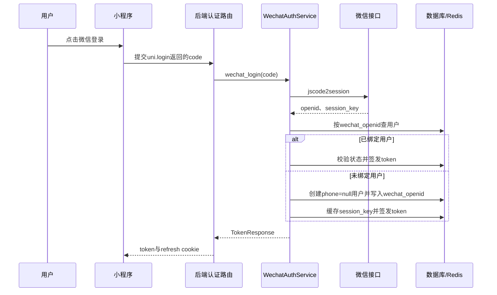
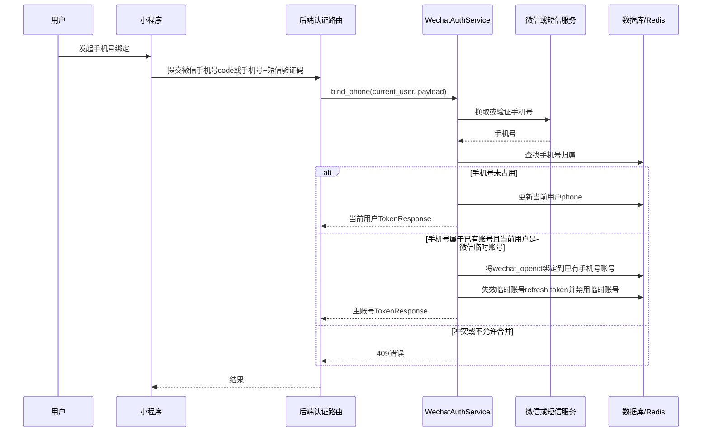

## Context

小程序登录页已有微信入口，但 `onSocialLogin('wechat')` 当前只展示占位提示。后端 `users` 表已有 `wechat_openid` 唯一字段，认证服务目前只支持手机号注册、手机号/用户名密码登录、refresh 和 logout。钱包充值等能力已经依赖 `wechat_openid`，因此需要把微信登录、OpenID 绑定和手机号绑定补成完整闭环。

## Goals / Non-Goals

**Goals:**
- 后端通过微信 code 换取 `openid/session_key`，并把 `openid` 绑定到 `users.wechat_openid`。
- 微信新用户允许先登录，创建 `phone = null` 的 app 用户并签发 token。
- 用户后续可绑定手机号：优先微信手机号授权，短信验证码作为备用。
- 手机号已存在时，允许把无手机号微信临时账号合并到已有手机号账号。
- 前端微信入口接入真实登录流程，并在用户缺少手机号时提示绑定。
- 更新 `docs/api.md`、OpenSpec 规格和任务清单。

**Non-Goals:**
- 不新增管理后台微信登录。
- 不做复杂资产迁移；临时微信账号已有余额、订单、优惠券等资产时，默认阻止自动合并。
- 不把 `session_key` 暴露给前端。
- 不删除已绑定的 `wechat_openid` 作为回滚手段。

## Decisions

1. 新增独立 `WechatAuthService`，不把微信 API 调用和账号合并塞入现有 `AuthService`。
   - 原因：微信登录、手机号授权和账号合并是独立认证子域，边界清晰后更容易测试。
   - 备选方案：直接扩展 `AuthService`。放弃原因是现有服务已经负责手机号注册、密码登录和 refresh/logout，继续扩大会降低可维护性。

2. 微信新用户先登录，再绑定手机号。
   - 原因：登录阻力最低，符合当前产品决策。
   - 代价：当前用户资料和部分业务点必须支持 `phone = null` 状态。

3. 手机号绑定采用“微信手机号授权优先，短信备用”。
   - 原因：微信授权路径更顺滑，短信备用能覆盖授权失败或微信接口不可用场景。
   - 代价：后端需要同时支持微信手机号 code 换取和现有短信验证码校验。

4. 手机号已存在时执行受限合并。
   - 规则：只允许“`phone IS NULL` 且 `wechat_openid` 非空”的微信临时账号合并到已有手机号账号。
   - 冲突：如果已有手机号账号已经绑定不同 `wechat_openid`，返回 409，不覆盖。
   - 资产保护：如果临时账号已有余额、订单、优惠券等资产，返回 409，不自动迁移。

5. `session_key` 使用 Redis 短期缓存。
   - 原因：`session_key` 是敏感且短期有效的数据，不应返回前端，也不需要持久化到数据库。

## 接口设计

### POST /api/v1/auth/wechat-login

请求体：

```json
{
  "code": "wx-login-code"
}
```

响应：复用现有 `TokenResponse`，同时沿用 refresh token cookie 设置。

行为：

- code 有效且 `openid` 已绑定用户：签发该用户 token。
- code 有效且 `openid` 未绑定用户：创建 `phone = null` 的 app 用户，写入 `users.wechat_openid`，生成 username/nickname，签发 token。
- 用户状态为 `banned` 或不可登录：返回 403。

### POST /api/v1/auth/wechat/bind-phone

认证：Bearer Token。

请求体：

```json
{
  "code": "wx-phone-code"
}
```

行为：

- 后端用微信手机号授权 code 换取手机号。
- 手机号未占用：绑定到当前用户。
- 手机号已属于已有账号且当前用户是微信临时账号：合并到已有账号并返回主账号 token。
- 手机号已属于已有账号且已有账号绑定不同微信：返回 409。

### POST /api/v1/auth/wechat/bind-phone/sms

认证：Bearer Token。

请求体：

```json
{
  "phone": "13800138000",
  "sms_code": "123456"
}
```

行为与微信手机号授权绑定一致，但手机号来源改为短信验证码校验。

## Sequence





## Risks / Trade-offs

- 微信接口配置缺失或不可用 -> 返回 503，并让前端保留手机号登录。
- 微信 code 有效期短 -> 每次登录或绑定都重新获取 code，不缓存前端 code。
- 账号合并误伤资产 -> 临时账号存在余额、订单、优惠券等资产时拒绝自动合并。
- 同一个手机号账号已绑定不同微信 -> 返回 409，不覆盖现有绑定。
- `phone = null` 影响现有响应模型 -> 更新 `UserProfileResponse` 和相关前端展示逻辑，避免把手机号当作必填。

## Migration Plan

1. 增加后端微信配置、schema、service、route 和测试。
2. 增加前端微信登录、手机号绑定入口和缺手机号提示。
3. 更新 `docs/api.md`，记录微信登录和手机号绑定接口。
4. 发布时先确认微信小程序配置和后端环境变量完整。
5. 回滚时关闭微信入口和后端微信接口；保留已有 `wechat_openid` 数据，手机号登录继续可用。

## Open Questions

- code 换取接口路径：确定为 `/api/v1/auth/wechat-login`。
- 微信新用户是否必须先绑定手机号：确定为不必须，允许先登录，后续绑定。
- 手机号已存在时如何处理：确定为受限合并，仅把无手机号微信临时账号合并到已有手机号账号。
