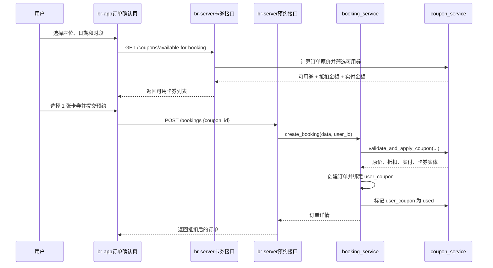

## Context

`br-app` 首页已有“卡券套餐”快捷入口，`prototype/coupon.html` 也提供了高保真卡券包原型，但当前系统没有真实卡券后端数据，也没有订单确认页选券和预约下单抵扣闭环。现有后端预约链路位于 `br-server/app/services/booking_service.py`，由服务层根据座位单价和预约时长计算 `total_price` 并创建订单。

本变更采用方案 A：`br-server` 提供用户卡券 REST 接口，预约下单接口增加可选 `coupon_id`，后端在下单服务层完成卡券校验、价格抵扣、订单绑定和卡券状态流转。用户确认首版范围为：系统预置/后台发放卡券、每个订单最多使用 1 张卡券、支持满减券/立减券/折扣券、支持全场通用/首次预约/指定座位类型、过期状态动态判断。

## Goals / Non-Goals

**Goals:**
- 新增 `br-server` 卡券模板和用户卡券模型，支撑真实用户卡券数据。
- 提供用户卡券列表接口和按预约参数筛选可用卡券接口。
- 修改预约下单流程，支持可选 `coupon_id`，并在后端完成可信价格计算。
- 订单保存原价、抵扣金额、实付金额和使用卡券。
- 下单成功后将用户卡券置为 `used`，取消订单时恢复该卡券为可使用状态。
- 在 `br-app` 实现卡券包页面，并在订单确认页支持选择卡券。
- 保持卡券包页面与 `prototype/coupon.html` 总体风格一致。

**Non-Goals:**
- 不实现用户自主领券入口。
- 不实现兑换码兑换。
- 不实现注册、活动、下单后的自动发券规则。
- 不实现多张卡券叠加。
- 不实现定时任务批量过期。
- 不实现后台卡券管理 UI；首版数据可通过数据库种子或后台发放脚本预置。
- 不新增第三方 UI 库、图标库或 Tailwind 运行时依赖。

## Decisions

### Decision 1: 使用卡券模板和用户卡券两层模型

后端新增 `coupons` 表表示卡券模板规则，新增 `user_coupons` 表表示用户持有的具体卡券。模板存类型、面额/折扣、门槛、适用范围、有效期等规则；用户卡券存用户归属、状态、使用订单和使用时间。

备选方案：只建一张用户卡券表，把规则字段复制到每张用户卡券。该方案查询简单，但规则复用和后续后台发放会重复数据，不利于扩展。

### Decision 2: 下单服务层是唯一可信抵扣入口

前端可以展示可用卡券和估算价格，但最终价格 MUST 由 `booking_service.create_booking` 调用卡券服务重新计算。服务层需要验证：
- 卡券属于当前用户。
- 卡券未使用、未过期、未绑定其他订单。
- 卡券满足订单金额门槛。
- 卡券适用范围匹配订单：全场通用、首次预约、指定座位类型。
- 每个订单最多绑定 1 张卡券。

备选方案：让前端传抵扣金额。该方案不安全，用户可以篡改金额，不符合后端可信边界。

### Decision 3: REST 接口保持简单，订单预结算暂不引入

新增接口：
- `GET /api/v1/coupons?status=available|used|expired`
- `GET /api/v1/coupons/available-for-booking?seat_id=&date=&start_time=&end_time=`
- `POST /api/v1/bookings` 请求体增加可选 `coupon_id`

不新增 `bookings/preview` 预结算接口。订单确认页通过 `available-for-booking` 获取可用券及每张券的抵扣金额/预计实付金额，正式下单时后端再次校验。

备选方案：增加订单预结算接口。该方案更严谨，但会引入额外订单预览状态；当前需求可以通过可用券筛选接口和下单二次校验满足。

### Decision 4: 动态判断过期，不引入定时任务

卡券数据库保留 `expires_at`。列表接口根据当前时间把过期未使用卡券归为 `expired`；下单接口再次基于当前时间校验。首版不写定时任务批量改状态。

备选方案：定时任务每天扫描并修改状态。该方案能让数据库状态更直观，但需要引入调度机制，首版成本过高。

### Decision 5: 取消订单恢复卡券

当用户取消 `confirmed` 订单且该订单使用了卡券时，首版将对应 `user_coupon` 恢复为 `available`，清空使用订单和使用时间。这样可以避免用户误取消后损失卡券。

备选方案：取消后不恢复卡券。该方案实现更简单，但对用户不友好，也容易引发客服问题。

## Data Model

### Coupon 模板字段

- `id`: 主键。
- `name`: 卡券名称，如“满20减3”。
- `description`: 展示说明，如“全场通用”。
- `type`: `amount_off`、`threshold_amount_off`、`percentage_off`。
- `discount_amount`: 金额券抵扣金额。
- `discount_percent`: 折扣券折扣比例，例如 80 表示 8 折。
- `min_order_amount`: 使用门槛，立减券可为 0。
- `scope`: `all`、`first_booking`、`seat_zone`。
- `seat_zone`: 当 `scope=seat_zone` 时指定座位类型，例如 `vip`。
- `valid_from`: 生效时间。
- `expires_at`: 过期时间。
- `is_active`: 是否启用。
- `created_at` / `updated_at`。

### UserCoupon 用户卡券字段

- `id`: 主键。
- `user_id`: 用户 ID。
- `coupon_id`: 卡券模板 ID。
- `status`: `available`、`used`。
- `used_booking_id`: 使用该券的订单 ID，可空。
- `used_at`: 使用时间，可空。
- `created_at` / `updated_at`。

过期状态不作为持久状态写入 `status`，由 `expires_at` 动态派生。

### Booking 金额字段

- `original_price`: 原价，未抵扣金额。
- `discount_amount`: 抵扣金额，未使用卡券时为 0。
- `total_price`: 实付金额，等于 `max(original_price - discount_amount, 0)`。
- `coupon_id`: 使用的 `user_coupons.id`，可空。

## API Design

### GET /api/v1/coupons

返回当前登录用户的卡券列表，支持 `status=available|used|expired` 过滤。

响应卡券字段包含：`id`、`coupon_id`、`name`、`description`、`type`、`scope`、`status`、`discount_amount`、`discount_percent`、`min_order_amount`、`valid_from`、`expires_at`、`used_at`、`used_booking_id`。

### GET /api/v1/coupons/available-for-booking

根据预约参数返回当前用户对该订单可用的卡券。参数包含 `seat_id`、`date`、`start_time`、`end_time`。后端通过座位价格和预约时长计算原价，并返回每张可用券的 `discount_amount` 与 `payable_amount`。

### POST /api/v1/bookings

请求体在现有 `seat_id`、`date`、`start_time`、`end_time` 基础上增加可选 `coupon_id`。如果传入卡券，后端校验并抵扣；如果校验失败，返回 400 或 409，不创建订单、不改变卡券状态。

## Main Flow

## Risks / Trade-offs

- [并发下同一张卡券被重复使用] -> 下单事务内重新查询并更新 `user_coupon`，实现时应使用行锁或状态条件更新，测试覆盖重复使用场景。
- [前端可用券结果过期或被使用] -> 下单时后端二次校验，失败时返回明确错误并要求用户重新选择。
- [折扣券金额精度问题] -> 使用 `Decimal` 计算，统一保留 2 位小数。
- [取消订单恢复卡券与退款策略冲突] -> 当前系统没有支付退款闭环，首版取消即恢复；后续接入支付后需结合退款状态调整。
- [动态过期导致数据库 status 仍为 available] -> API 响应 status 以派生状态为准，下单校验以 `expires_at` 为准。

## Migration Plan

1. 新增卡券表和预约金额字段迁移。
2. 新增卡券模型、schema、service、route，并接入 `app/main.py`。
3. 修改预约 schema/service/route，支持 `coupon_id` 和金额拆分。
4. 新增后端单元测试和 API 集成测试。
5. 修改 `br-app` 卡券包页面读取真实接口。
6. 修改订单确认页加载可用券、选择卡券、提交 `coupon_id`。
7. 更新 `docs/api.md`。
8. 执行后端测试和前端 H5 构建。

## Open Questions

已确认：
- 真实卡券数据由 `br-server` 提供。
- 首版实现完整卡券闭环，而不是仅展示列表。
- 卡券来源为系统预置/后台发放。
- 每个订单最多使用 1 张卡券。
- 卡券类型支持满减券、立减券、折扣券。
- 适用范围支持全场通用、首次预约、指定座位类型。
- 过期状态采用动态判断。
- 接口采用用户卡券 REST 接口 + 下单接口 `coupon_id`。
