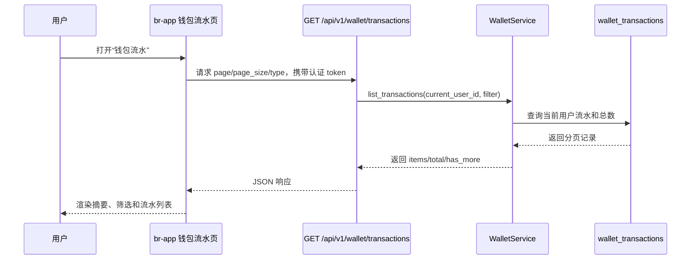

## Context

`br-app` 已有 `/pages/recharge/index` 钱包充值页和 `src/api/wallet.js` 钱包 API 封装，个人中心显示账户余额并提供“钱包充值”入口。`br-server` 已有 `wallet_transactions` 表、`WalletService`、`/api/v1/wallet` 路由和余额/充值相关 schema，但当前缺少面向用户的钱包流水查询端点，也缺少移动端交易明细页面。

本次变更跨移动端页面、前端 API 封装和后端钱包查询能力。UI 风格延续 `prototype/recharge.html`、`prototype/profile.html` 和已落地页面的主色、白色卡片、弱化空状态、底部安全区处理。

## Goals / Non-Goals

**Goals:**
- 新增用户侧钱包流水页面，展示余额摘要、收入/支出统计和交易列表。
- 支持流水类型筛选、分页加载、下拉刷新、空状态和错误重试。
- 新增当前认证用户的流水查询 API，后端强制按 `user_id` 过滤。
- 复用现有 `wallet_transactions` 表和钱包服务分层。
- 更新 API 文档并覆盖后端服务、接口和前端关键状态测试。

**Non-Goals:**
- 不新增提现、退款、转账或管理后台流水审核能力。
- 不改造充值支付流程，不新增支付渠道。
- 不提供流水导出、发票或对账后台。
- 不新增独立钱包首页，流水入口从现有个人中心/钱包区域进入。

## Decisions

### 1. 前端页面放在 `/pages/wallet/transactions`

**选择**：新建 `br-app/src/pages/wallet/transactions.vue`，并在 `pages.json` 注册标题“钱包流水”。

**理由**：流水属于钱包域，与充值页同层但不应塞进充值页，后续若新增钱包首页也能继续挂在 `/pages/wallet/*` 下。

**备选**：放在 `/pages/recharge/transactions`。该路径把流水强绑定充值流程，不利于未来展示消费、退款等非充值流水。

### 2. 入口优先放在个人中心会员服务区域

**选择**：在 Profile 的会员服务菜单中新增“钱包流水”主入口，并在充值页余额卡片区域增加“交易明细”轻入口；保留现有“钱包充值”入口。

**理由**：个人中心已有账户余额、钱包充值和卡券入口，用户查资金明细的路径最短；充值页是充值完成后的高相关场景，提供轻入口可减少用户回查路径，但不把流水页隐藏在充值流程内。

**备选**：只在充值页提供入口。用户需要先进入充值功能才能查看明细，信息架构不直接。

### 3. API 使用分页列表而非一次性返回全部

**选择**：新增 `GET /api/v1/wallet/transactions?page=1&page_size=20&type=all|recharge|consume|refund`，返回 `items`、`total`、`page`、`page_size`、`has_more`。前端本期只展示“全部”“充值”两个筛选，API 保留 `consume/refund` 类型以兼容后续订单消费和退款流水。

**理由**：流水天然增长，分页可控；`type=all` 便于前端保留一个统一筛选状态。后端当前只有 `recharge` 数据，但契约预留 `consume/refund`，不要求本次产生这些类型。

**备选**：基于 cursor 分页。当前移动端列表规模和已有项目 API 风格更适合 page/page_size，cursor 可在高频流水场景再引入。

### 4. 交易金额和状态由后端格式化为稳定字段

**选择**：后端返回 `id`、`type`、`title`、`amount`、`bonus_amount`、`direction`、`status`、`payment_method`、`balance_after`、`created_at`、`completed_at`、`order_id`。

**理由**：前端只负责展示，不根据订单内部字段推断业务含义；`direction` 直接决定收入/支出样式，`title` 可由后端保持领域一致。

**备选**：前端基于 `type/status/payment_method` 自行拼标题和符号。这样会把钱包领域规则散落到 UI，后续新增消费/退款容易出现展示不一致。

### 5. 充值流水标题和状态映射

**选择**：本期明确充值流水的展示映射：`completed` 显示“充值到账”，`pending` 显示“充值待支付”，`failed` 显示“充值失败”；充值类 `direction` 为 `income`，只有 `completed` 状态使用到账成功视觉。

**理由**：当前真实数据主要来自充值订单，先把已知领域规则写清楚，避免实现阶段出现不同页面文案不一致。`consume/refund` 的标题映射留给对应业务变更补充。

**备选**：所有充值统一显示“钱包充值”。该方案无法区分待支付、到账和失败状态，用户难以理解资金是否已入账。

### 6. 后端查询只读且强制用户隔离

**选择**：在 `WalletService` 增加 `list_transactions(user_id, page, page_size, type)`，路由继续使用 `get_current_user_id`，查询条件必须包含 `WalletTransaction.user_id == str(user_id)`。

**理由**：钱包流水是用户资金数据，权限边界必须由后端强制执行。该方法是只读查询，不需要修改交易创建逻辑。

**备选**：前端传 `user_id` 查询。该方案存在越权风险，不采用。

### 7. UI 采用现有品牌体系的资金列表模式

**选择**：钱包流水页沿用现有 `#4F6EF7` 主色、白色卡片、圆角和弱化分隔线；顶部使用余额摘要卡，筛选使用紧凑 segmented tabs，列表项左侧为类型图标，右侧为金额，底部展示支付方式、时间、交易后余额和赠送金额。

**理由**：UI UX Pro Max 对移动列表和资金类界面的建议是提供清晰加载反馈、空状态行动入口、懒加载分页和正负金额视觉区分。项目已有稳定品牌色和页面语言，本次不引入新的紫色/绿色设计系统，避免与个人中心、充值页割裂。

**备选**：采用独立金融深色主题或夸张极简风。该方案会让钱包流水页脱离当前学习预约应用的轻量移动端风格。

### Sequence

## Risks / Trade-offs

- **[历史流水类型单一]** → 当前表主要由充值产生，筛选保留 `recharge/consume/refund`，无数据类型展示空状态，不伪造消费/退款记录。
- **[余额摘要与列表统计不一致]** → 页面余额摘要调用现有 `GET /api/v1/wallet/balance`，列表统计只基于当前加载/接口返回的流水聚合，文案避免暗示全量财务报表。
- **[分页总数查询成本]** → 初期使用 `COUNT(*)` 搭配 `user_id/type` 索引；如数据量增长，再改 cursor 或增加覆盖索引。
- **[前端金额精度]** → 后端以 Decimal 字符串返回金额，前端只做展示格式化，避免浮点计算参与资金逻辑。
- **[越权访问]** → 流水 API 不接受 `user_id` 查询参数，所有查询以 token 解析出的用户为准。

## Migration Plan

1. 后端新增 schema、service 查询方法、route 和测试，不改变现有充值写入流程。
2. 前端新增页面、路由、API 方法和入口，灰度验证真实用户有无流水时的展示。
3. 更新 `docs/api.md` 钱包接口文档。
4. 回滚时移除新增页面/路由/入口和 `GET /api/v1/wallet/transactions` 相关代码；若实现阶段补充数据库索引，通过 Alembic downgrade 回滚索引。

## Open Questions

- 已确认：入口采用“个人中心主入口 + 充值页余额卡片轻入口”，不新增独立钱包首页。
- 已确认：本期 UI 只展示“全部”“充值”筛选；API 保留 `consume/refund` 预留类型，消费/退款的业务标题和状态枚举在对应业务变更中扩展。
