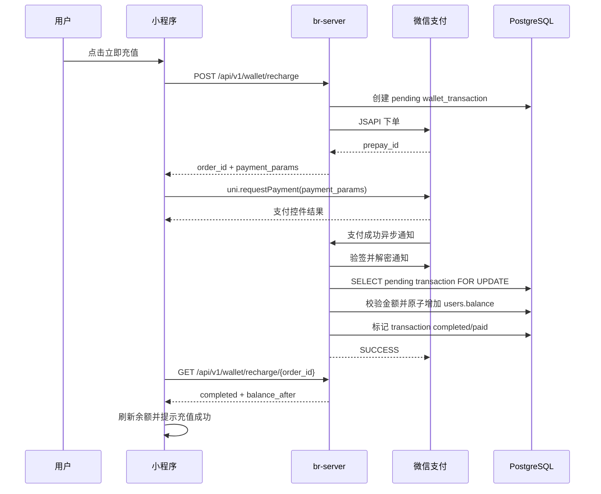

## Overview

本变更将现有钱包充值链路接入微信支付 JSAPI。后端负责创建充值订单并调用微信支付统一下单，前端只负责唤起微信支付控件；余额入账只在后端收到并验证微信支付成功通知后执行。这样可以避免客户端伪造支付成功、重复入账和并发回调导致的余额错误。

## Goals

- 支持微信小程序内真实充值支付。
- 支付成功后自动增加用户钱包余额并记录交易流水。
- 支持支付结果未知时的状态查询和前端轮询。
- 回调处理具备签名校验、金额校验、状态幂等和并发安全。
- 微信支付配置可在测试、预发、生产环境隔离。

## Non-Goals

- 不实现支付宝真实支付。
- 不实现退款、部分退款或资金提现。
- 不改造预约订单为先支付后确认；本次只覆盖钱包充值。
- 不引入第三方支付聚合平台。

## Architecture

### Backend Components

- `WechatPayClient`
  - 封装微信支付 API v3 请求签名、统一下单、订单查询、通知验签和通知解密。
  - 只暴露业务需要的方法：`create_jsapi_prepay`、`query_order`、`verify_and_decrypt_notify`。

- `WalletService`
  - 创建充值订单时写入 pending 交易。
  - 对微信支付生成 out_trade_no，调用 `WechatPayClient` 获取 prepay_id。
  - 生成小程序端 `uni.requestPayment` 所需参数。
  - 处理微信支付成功通知并原子更新余额。

- `wallet` routes
  - `POST /api/v1/wallet/recharge`：创建充值订单并返回支付参数。
  - `GET /api/v1/wallet/recharge/{order_id}`：查询充值订单状态。
  - `POST /api/v1/wallet/wechat/notify`：微信支付异步通知入口。

### Frontend Components

- `src/api/wallet.js`
  - 新增订单查询 API。
  - `createRechargeOrder` 适配支付参数响应。

- `src/pages/recharge/index.vue`
  - 微信支付：调用创建订单 API 后使用 `uni.requestPayment`。
  - 支付控件返回 success 后，不直接视为入账成功，而是查询后端订单状态。
  - 支付取消、失败、未知状态分别给出提示，并允许用户重试或稍后刷新余额。

## Data Model

扩展 `wallet_transactions`：

- `payment_provider`: `wechat`、`alipay`，当前仅微信可用。
- `payment_status`: `pending`、`paid`、`failed`、`closed`。
- `prepay_id`: 微信预支付交易会话标识。
- `transaction_id`: 微信支付订单号，唯一，可空。
- `paid_at`: 微信确认支付成功时间。
- `notify_payload`: 记录最后一次有效通知摘要或 JSON。
- `notify_processed_at`: 回调处理时间。

`status` 继续表示钱包交易入账状态，建议与 `payment_status` 明确区分：

- `status=pending`：钱包未入账。
- `status=completed`：钱包已入账。
- `status=failed`：订单关闭或支付失败，钱包未入账。

## API Design

### Create Recharge Order

`POST /api/v1/wallet/recharge`

Request:

```json
{
  "amount": 100,
  "payment_method": "wechat",
  "promo_code": "SAVE30"
}
```

Response:

```json
{
  "order_id": "7b9f8d7e-6c0b-4df8-9e4e-28a4b8bb3b11",
  "amount": "100.00",
  "bonus_amount": "30.00",
  "status": "pending",
  "payment_provider": "wechat",
  "payment_status": "pending",
  "payment_params": {
    "timeStamp": "1778912580",
    "nonceStr": "random",
    "package": "prepay_id=wx201410272009395522657a690389285100",
    "signType": "RSA",
    "paySign": "signature"
  }
}
```

### Query Recharge Order

`GET /api/v1/wallet/recharge/{order_id}`

Returns order payment and wallet status for the current user. The endpoint must not expose other users' orders.

### WeChat Notify

`POST /api/v1/wallet/wechat/notify`

This endpoint receives WeChat Pay API v3 notifications. It reads signature headers, verifies the request, decrypts `resource`, validates amount and out_trade_no, and returns the WeChat-required success/failure response.

## Payment Sequence



## Error Handling

- 微信统一下单失败：交易保持 `pending` 或标记 `failed`，前端提示“支付创建失败，请重试”。
- 用户取消支付：交易保持 `pending`，前端提示“支付已取消”，不入账。
- 前端支付成功但回调未到：前端轮询订单状态，超过次数提示“支付处理中，请稍后查看余额”。
- 回调重复到达：通过 `order_id`/`transaction_id` 唯一约束和行级锁保证只入账一次。
- 回调金额不一致：拒绝入账，记录告警日志，返回失败或业务错误。
- 签名或解密失败：返回失败，不落库敏感明文。

## Security

- 微信支付 API v3 密钥、商户私钥和证书序列号必须来自环境变量或密钥文件路径，不提交仓库。
- 通知接口必须校验 `Wechatpay-Signature`、`Wechatpay-Timestamp`、`Wechatpay-Nonce`、`Wechatpay-Serial`。
- 回调解密后必须校验 `appid`、`mchid`、`out_trade_no`、`trade_state=SUCCESS`、金额和币种。
- 前端 `uni.requestPayment` 的 success 结果只能用于改善体验，不能作为入账依据。

## Testing Strategy

- 单元测试覆盖签名构造、支付参数生成、回调验签失败、金额不一致、重复回调幂等。
- 服务测试覆盖创建微信充值订单、回调成功入账、用户隔离查询、订单不存在。
- 接口测试覆盖认证、创建订单响应、查询订单、微信通知成功与失败。
- 前端测试或手工验收覆盖支付成功、取消、失败、处理中四种状态。
