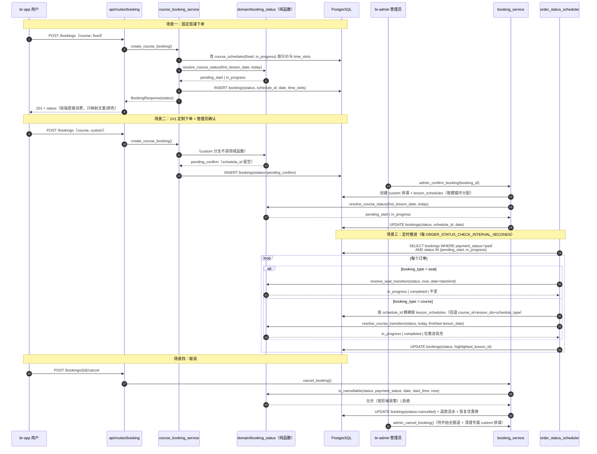

## Context

动机见 `proposal.md` — Why，此处只记录塑造方案的现状与约束。

> **本文件为 open 阶段的高层方案框架**；深度技术细化见 Design Doc `docs/superpowers/specs/2026-09-03-booking-order-lifecycle-refactor-design.md`，实测证据见 `.comet/handoff/brainstorm-summary.md`（F1-F28）。本文件中被 design 阶段推翻或修正的结论已就地标注。

**现状：状态判定分散在 5 个服务共 7 处（open 阶段估为 4 个服务，实测补齐），无单一事实源**

| 位置 | 承担的状态职责 |
|---|---|
| `booking_service.create_booking:284-290` | 座位订单初始状态：`initial_status = "pending" if now < booking_start else "confirmed"`（余额支付），微信支付无条件 `"pending"` |
| `booking_service` 列表筛选`:355-393` | `status.in_(["pending", "pending_confirm"])` 表达"待开始"虚拟语义；`status == "confirmed"` 表达"进行中"；课程订单额外做 `CourseSchedule.start_date <= today` **后置过滤** |
| `booking_service.admin_confirm_booking:1230-1244` | 定制订单确认后：`booking.status = "confirmed" if booking_date <= today else "pending"` |
| `course_booking_service:420-436` | 固定班课下单：按第一课时日期与今天比较定 `pending`/`confirmed`；`custom` → `pending_confirm` |
| `booking_payment_service:275-299` | 支付成功后：**`_determine_course_booking_status`**（open 阶段误写为 `_resolve_status_after_payment`）按订单类型与开课日期/时段定状态 |
| `order_status_scheduler:79-98,164-177` | 定时推进：座位按分钟级比较、课程按天级比较，`pending → confirmed → completed` |
| `booking_verification_service:189-192,255-258,264,275-281,353-356` | **核销域**（open 阶段漏列）：可核销复合判定 4 处 + 窗口内/外状态转移判定 1 处 |

前端另有 **4 份**派生实现（open 阶段未列）：br-app `orders/index.vue` 的 `displayStatus()` / `isOrderStarted()` / `isOrderPendingStart()`，与 `verify-booking/index.vue` 的 `statusText`。

同一"开课日期 vs 今天"比较在 `booking_service`、`course_booking_service`、`booking_payment_service`、`order_status_scheduler` 各写一份；`booking.status` 与 `booking.payment_status` 都有 `"pending"` 字面量，靠上下文区分（实测双 `pending` 同现点 **7 处**）。

**现状：`time_slots` 解析与"周几 HH:MM-HH:MM"格式化三端各写一份**

- 涉及 23 个文件；`weekday` 格式化涉及 12 个文件（br-server 4、br-admin 3、br-app 5）。
- br-app 已有 `src/utils/formatters.js`、br-admin 已有 `src/views/booking/list/builders.ts`，均为**局部**工具，未覆盖 `ScheduleModal.vue` / `TeacherScheduleModal.vue` / `course-booking.vue` 等处的重复实现。
- **三端展示文案并不相同**（br-admin 0-based 顿号完整时段 vs br-app 1-based 口语化「每周三 14:00上课」），因此只能统一**数据契约**、不能统一展示文案（修正 D3）。

**现状：时区工具重复（open 阶段未列）**

全仓"当前业务本地时间"函数 **5 个定义**（订单链路内 3 个：`booking_now` naive / `_now_naive` naive / `_booking_now` **aware**），模块级 `CHINA_TIMEZONE` 常量 **6 处重复定义 + 1 处等价变体**，全仓 `replace(tzinfo=None)` **12 处**。领域纯函数若被 naive/aware 两类调用点共用会直接抛 `TypeError`，故时区收敛是**强制前置**。

**现状：已核实的失效代码与文档矛盾**

1. `order_status_scheduler._update_highlight` 的 `stats["course_started"]` 永不自增：`highlighted_lesson_id` 在订单创建时从不赋值（全仓仅 scheduler 与响应构造读写它），故为 `None`；`is_new_start=True` 时 `None != target_lesson.lesson_id` 必为真，进入 `if` 分支后 `if not is_new_start` 为假、`elif is_new_start` 不可达。该计数器无任何测试覆盖。
2. `order_status_scheduler.py:168` 注释"高亮当前课时（第一个 `lesson_date >= today` 的课时）"与 `_update_highlight` 实现"最后一个 `lesson_date <= today` 的课时"矛盾。
3. `booking_cleanup_service.cleanup_unpaid_bookings`（15 分钟未支付自动取消）**命名伪装成已接入定时任务**：`main.py:69` 的 job 叫 `_cleanup_unpaid_bookings_job`、日志写「[微信支付对账定时任务]」，实际调的是 `reconcile_pending_payments()`，该服务零生产引用。
4. br-app `orders/index.vue` 内 3 个局部常量 `TABS`(`:267`) / `STATUS_MAP`(`:274`) / `ZONE_MAP`(`:281`) **零消费方**（页面 `:293` 实际用导入的 `BOOKING_TABS`），且 `STATUS_MAP.pending='待确认'` 与 `BOOKING_STATUS_LABELS.pending='待支付'` 互相矛盾。
5. `BOOKING_STATUS_LABELS.confirmed = '已预约'` 是**死键**（`displayStatus()` 总把 `confirmed` 转为 `in_progress`，从未流入查表）。

**现状：管理端会话有效期**

`admin_auth_service.py:41` 使用 `config.ACCESS_TOKEN_EXPIRE_MINUTES`（默认 **15 分钟**），与 C 端 br-app 共用同一配置项。`REFRESH_TOKEN_EXPIRE_DAYS=3` 存在但管理端登录链路未使用刷新令牌。**br-admin `store/modules/user.ts:69,95` 已硬编码 7 天**，故真正根因在后端 JWT `exp`，前端已存 7 天。

**约束**

- `bookings.status` 为 `String(20)`，无 DB enum/CHECK 约束；新值最长 15 字符，属纯数据迁移。
- 当前 alembic head：`f6a7b8c9d0e1`。**测试用 SQLite in-memory `create_all`，不跑 alembic**（`tests/conftest.py:34`）→ 数据迁移零自动化覆盖。
- 项目约定：Clean Architecture、DDD、后端分层 `api/routes → services → models → schemas`、核心逻辑单测覆盖率目标 > 90%、API 需集成测试。**本次覆盖率不设门槛**（Q2 用户显式撤回）。
- 全量测试基线：14 failed / 751 passed / 16 skipped / 81 errors（114.44s），95 项红灯按 **11 个文件归组**且 **100% 与订单生命周期无关**。
- 时区统一 `Asia/Shanghai`；`config.py:35 BOOKING_TIMEZONE` 已存在。
- **`app/domain/` 已存在且 4 个模块活跃**（含 `booking_rules.py`、`verification_rules.py`）；**br-server 无 `app/utils/` 层**。

## Goals / Non-Goals

**Goals:**

- 订单状态词表有唯一权威定义处，服务层与定时任务不再自行拼装状态字面量。
- "开课日期 vs 今天 → 状态"这类判定只有一处实现，后端 7 处与前端 4 份全部收敛。
- `time_slots` 解析在三端各自收敛到单一工具模块，**数据契约统一**、展示文案各自保留。
- 时区工具收敛为单一事实源，aware/naive 混用风险消除。
- 管理端会话有效期由独立配置控制，与 C 端解耦。
- 重构后行为等价（除刻意修复的 `course_started` 统计与注释矛盾），验收判据为**红名单集合恒等**（~~全量测试通过且覆盖率 > 80%~~ —— Q1/Q2 用户决策已撤回）。
- 用户可见文案零变更（含未支付订单的「待支付」标签，Q13）。

**Non-Goals:**

- 不改 `payment_status` 词表（`pending`/`paid`/`failed` 保持原值）。
- 不改 `course_schedules.schedule_status` / `lesson_schedules.schedule_status` 词表（其 `in_progress`/`completed` 是排课域状态，与订单域同名但不同表，本次只明确边界、不重命名）。
- 不改 br-app 审核域（`accountSecurity.js:7`）与钱包交易域（`wallet/transactions.vue`）、br-admin `WALLET_STATUS_TAGS.pending` 的同名值。
- 不重构 RBAC、钱包、优惠券、卡券核销等非订单生命周期模块（核销域**仅**抽取状态判定，不改核销业务规则）。
- 不迁移排课域的 `time_slots`；不统一三端展示文案。
- 不引入新的外部依赖、不改数据库表结构（仅数据迁移）。
- 不治理既有 95 项红灯（建议另开 change）。
- 不改 UI 视觉设计；br-admin/br-app 仅做状态取值与文案映射的等价替换，保持与 `prototype/` 原型总体风格一致。

## Decisions

### D1. 状态词表落位：新增领域层模块

采用 `br-server/app/domain/booking_status.py` 承载 `BookingStatus` 枚举、`PaymentStatus` 枚举与状态判定纯函数。

> **修正（F3）**：open 阶段误写为"新建 `app/domain/` 目录"。实测 `app/domain/` **已存在且 4 个模块活跃**（`booking_rules.py` 已承载 `has_booking_started` / `can_cancel_paid_booking` / `should_mark_booking_completed`，`verification_rules.py` 已承载核销窗口/金额规则），本次只是**新增文件**，且新增的核销判定函数按 Q12 落 `verification_rules.py` 而非 `booking_status.py`。

- **理由**：项目已声明遵循 Clean Architecture 与 DDD，但状态规则寄生在 services 中，导致多个服务各自实现。判定逻辑为纯函数（输入日期/时间/状态，输出状态），不依赖 SQLAlchemy session，可独立单测。
- **备选 A（否决）**：枚举写在 `app/models/booking.py`。模型层已被 services 与 schemas 双向依赖，把领域规则放这里会让判定逻辑与 ORM 耦合，无法脱离 session 单测。（已按 Q9 采取折中：`models/booking.py` 改为 **re-export** 单一事实源）
- **备选 B（否决）**：写 `app/core/constants.py`。`core` 现承载配置与数据库基础设施，混入业务规则会模糊分层边界。

### D2. ~~虚拟展示状态：后端派生并随响应返回~~（已推翻）

> **推翻（Q5 + 逐分支实测，Design Doc §2.7）**：原计划新增只读派生字段 `display_status`。实测 br-app `displayStatus()` 的 **4 个分支返回值全部等于 `order.status`**（`pending_confirm` 自映射、`pending + paid → pending_start`、课程 `confirmed → in_progress`、座位 `confirmed + now >= bookingStart → in_progress`）—— 重命名后展示状态与落库状态**恒等**，再新增一个与之恒等的只读字段是纯冗余。
>
> **改为**：**不新增 `display_status`**，删除前端 4 份派生实现、模板直接消费 `status`；C 端 `?status=pending_start` / `?status=in_progress` 的**派生筛选口径保持现行不变**（行为零变更），其中 `pending_start` 仍包含 `pending_confirm` 订单这一既有不一致**只记录不修复**。
>
> 原 D2 担心的"三端口径再次分叉"由 `booking-status-domain` delta spec 的第 5 条 Requirement（筛选语义保持）+ Design Doc §2.6 + `docs/booking-rules.md` 对照记录共同锁定，不需靠新增字段。

### D3. `time_slots` 工具落位：三端各一模块，~~共享同一格式契约~~ → 拆为两层

- br-server：`app/utils/time_slots.py`（**br-server 当前无 utils 层**，本次新建；只承载解析与**数据契约**重建，不承载展示文案）。
- br-app：保留现有 `src/utils/formatters.js` 输出口径（1-based `COURSE_WEEKDAY_NAMES`、口语化「每周三 14:00上课」/「工作日 14:00上课」、旧版纯文本原样返回）。
- br-admin：保留 `views/booking/list/builders.ts:formatTimeSlots` 现状（0-based 顿号完整时段「周三 10:00-12:00、周六 12:00-14:00」）。
- **修正（F15）**：open 阶段写"共享同一格式契约"未区分层次。实测三端**展示文案本就不同且各自正确**，强行统一会造成用户可见文案变更。故拆为：**数据契约层统一**（`weekday` 取值 1-7、`time_slot` 为 `HH:MM-HH:MM`）/ **展示文案层不统一**（三端各自保留）。
- **理由**：三端语言与运行时不同（Python / uni-app JS / Vue3+TS），无法共享代码；契约写进 delta spec 与 `docs/booking-rules.md`，避免再次各写一份。
- **备选（否决）**：后端预格式化字符串返回、前端不解析。会破坏 br-admin 排课编辑等需要结构化 `time_slots` 的场景，且会强制统一展示文案。

### D4. 定时任务重构：编排与判定分离

`order_status_scheduler` 保留 APScheduler 编排、取数与提交职责；`_process_seat_booking` / `_process_course_booking` 内的状态判定改为调用 D1 领域函数。同时修复 `course_started` 统计不可达缺陷与注释矛盾。

- **理由**：定时任务是"失效代码"与"重复判定"最集中的地方；把判定抽为纯函数后，定时任务的行为可用领域单测覆盖，不再依赖调度器集成测试。
- **备选（否决）**：把三个定时任务合并为一个。微信支付对账（IO 密集、外部依赖）与状态推进（纯本地比较）失败模式与频率不同，合并会放大故障面；`docs/booking-rules.md` 已记录职责分离为既有架构决策。

### D5. 管理端会话有效期：独立配置项

新增 `ADMIN_ACCESS_TOKEN_EXPIRE_DAYS`（默认 ≥ 3），`admin_auth_service` 改用该配置；`ACCESS_TOKEN_EXPIRE_MINUTES` 保持 15 分钟不变，C 端 br-app 不受影响。

- **理由**：直接调大 `ACCESS_TOKEN_EXPIRE_MINUTES` 会同时把 C 端 access token 拉长到 3 天，移动端令牌长期有效会放大丢失设备的风险，属不可接受的连带影响。
- **备选（否决）**：为管理端启用刷新令牌链路。改造面显著更大（需前端拦截器与 cookie 策略），且用户诉求只是"至少三天不失效"，单点配置即可满足。

### D6. 重命名执行顺序：先时区、再死代码、再枚举、后字面量、最后数据迁移

> **修正**：open 阶段的 4 步未包含时区收敛与死代码清理。实测 aware/naive 混用会使领域纯函数直接抛 `TypeError`（F19），故时区必须**强制前置**；死代码先删可缩小后续字面量替换面。

完整 6 步（每步独立可验证，验收均为**红名单集合恒等**）：

1. 死代码清理 + 误导命名重命名（Design Doc §6 的 15 项）+ `import json` 提顶。
2. 新建 `domain/booking_status.py`（**枚举值仍为旧字面量**）+ `utils/time_slots.py`，服务层改为调用纯函数（纯重构，零行为变更）。
3. 修 `course_started` 自增 + `:168` 注释 + **时区 aware/naive 统一**（新建 `utils/timezone.py`）。
4. 枚举值切换为新词表 + 三端全部改用枚举/常量。
5. alembic 数据迁移 + 管理端会话有效期 + 前端 `expires_in` 读取。
6. 更新 `docs/booking-rules.md`、`docs/api.md`、`bug-fixed.md`。

- **理由**：把"结构重构"与"取值变更"拆成两个可独立验证的步骤，任一步失败都能定位到是分层问题还是词表问题；先重构后改名可让既有测试成为重构的等价性护栏。
- **备选（否决）**：一次性全局替换 248 处字面量。无法区分回归来自重构还是改名。

### 复杂流程序列图：课程订单从下单到完成/取消（重构后）

> 图中已删除 open 阶段的 `display_status` 返回（D2 推翻）；`assert_cancellable` 改为实测存在的 `is_cancellable`（`domain/booking_rules.py:32-46` 已有 `can_cancel_paid_booking`）。

## Risks / Trade-offs

- **[同名字面量误改]** `payment_status="pending"` 与 `status="pending"` 在 74 处后端命中中混在一起，全局替换极易误改支付状态 → 用 D1 两个独立枚举做类型区分；替换后 grep 校验 `payment_status` 仍为 `pending/paid/failed`；迁移脚本 WHERE 条件显式限定 `status` 列。
- **[跨域同名值误改（实测 6 类，open 阶段只列 2 类）]** 除 `payment_status` 与排课域 `schedule_status` 外，实测另有 4 类同名值：**`lesson_schedules.schedule_status='in_progress'`**、**`course_schedules.schedule_status='in_progress'`**（两者与订单域重命名后取值相同但语义不同）、**br-admin `WALLET_STATUS_TAGS.pending`**（钱包域）、**br-app `accountSecurity.js:7 status==='pending'`（审核中）与 `wallet/transactions.vue:279,290,333`**（钱包域）→ 枚举分域定义、不合并、不复用同一枚举；delta spec 与 `docs/booking-rules.md` 显式声明 6 类不等价；Design Doc §10 给出 **7 条 grep 守卫**（含「br-app 审核域与钱包域未被改动」的定点断言）。
- **[新旧值混存]** 生产残留旧后端进程按旧词表写入 → **发布顺序强制为「先停服并彻底杀掉残留旧进程 → 再执行数据迁移」**（open 阶段误写为「迁移 → 部署后端」，见 F17：停服若晚于迁移，旧进程会在迁移后继续按旧词表写入，使迁移失效）；迁移脚本设计为幂等（仅 UPDATE 命中旧值的行），可在混存后重跑收敛。该项目历史上已发生过残留旧进程按旧逻辑误转订单状态的事故。
- **[三端发布耦合]** API 契约变更无向后兼容窗口，任一端滞后即故障 → **已决策：严格同批次硬切（Q3），不引入读侧双接受兼容层**。理由：兼容层会遗留新旧词表并存的技术债务，与「消除失效代码」目标相反。风险由发布顺序（停服优先）+ 迁移幂等 + 成对 `downgrade()` 兜底。
- **[既有红灯掩盖回归]** 95 项既有失败使"全量测试通过"无法作为重构护栏 → **已决策：不治理既有红灯（Q1），验收判据改为「红名单集合恒等」**——逐项比对 FAILED/ERROR 的测试 ID 集合（而非仅数量不增），防止「修好一个又弄坏一个」的抵消。95 项红灯经实测按 **11 个文件归组、100% 与订单生命周期无关**，建议另开 change 治理。
- **[时区 aware/naive 混用（open 阶段未识别）]** 订单链路内 3 个「当前业务本地时间」定义中 `booking_verification_service._booking_now` 返回 **aware**、另两个返回 **naive**；领域纯函数若被两类调用点共用会直接抛 `TypeError: can't compare offset-naive and offset-aware datetimes` → 时区收敛（D6 第 3 步）为**强制前置**；Q11 决策：aware 孤岛只在其模块边界降级，不改造其内部 aware 比较。
- **[未支付订单标签退化（Q13）]** `BOOKING_STATUS_LABELS.pending='待支付'` 把支付域语义挂在订单状态词表上；删除该键后未支付座位订单会退化为「待开始」→ Q13 决策：br-app `statusLabel()` 增加 `payment_status === 'pending'` → 「待支付」**前置分支**，配套新增 `PAYMENT_STATUS_LABELS`，保证用户可见文案零变更；`study-room-booking-ui` delta spec 已加对应 Scenario。
- **[br-app 新旧词表混用]** `BOOKING_TABS` 已用 `pending_start`/`in_progress` 作查询参数，`BOOKING_STATUS_LABELS` 仍保留旧词表键 → 词表切换必须一次性完成两个常量的对齐，避免 Tab 能筛出订单但标签查不到文案。
- **[多份派生实现收敛不彻底]** 后端 7 处 + 前端 4 份派生实现，只改其中一部分会造成三端口径再次分叉 → 由 `booking-status-domain` delta spec 第 5 条 Requirement（筛选语义保持）+ Design Doc §2.6/§4.2 + `docs/booking-rules.md` 对照记录共同锁定；grep 守卫第 6 条断言 br-app 订单页不再存在 4 个已删除标识符。
- **[主 spec 错误断言（F28）]** `study-room-booking-api` 主 spec 有 3 处与实测不符（余额支付初始状态、取消前置状态数量、自动完成时间点边界）→ 已在 delta spec 按实测修正并在 Design Doc §12.1 逐条记录；**其中 G/H 属修正文档错误断言、非行为变更**，需在交付说明中向用户明示。
- **[worktree 环境解析]** br-server 存在 editable 安装（`br_server.egg-info`），在 worktree 中运行 pytest 有解析到主工作区代码的风险 → build 前验证 `sys.path` 与 `app.__file__` 指向 worktree；br-admin `node_modules` 在 worktree 中缺失，需 `pnpm install` 后再构建。
- **[重构范围膨胀]** Clean Architecture 分层重构可能牵出订单域之外的耦合 → 以 Non-Goals 为硬边界；命中跨模块扩散时回到升级/拆分决策点，不自行扩范围。

## Migration Plan

**部署顺序（不可调换；停服必须先于迁移 —— 修正 F17）**

1. **停服**：停止后端服务并**彻底杀掉残留旧进程**（`ps` 核对无存活进程）。旧进程若仍存活，会在迁移后继续按旧词表写入，使迁移失效——该项目历史上已发生过此类事故。
2. 备份 `bookings` 表（至少 `id, status, payment_status` 快照）。
3. `alembic upgrade head`：执行状态值数据迁移（幂等，仅 UPDATE 命中旧值的行；WHERE 显式限定 `status` 列）。
4. 部署后端新代码并启动。
5. 发布 br-admin、br-app。
6. 验证：新建座位/课程订单、管理员确认定制订单、定时任务推进、取消退款各走一遍；抽查 `bookings.status` 无旧值残留；核对 br-app 未支付订单仍显示「待支付」（Q13）。

**验证缺口（必须人工补齐）**

- 测试用 SQLite in-memory 走 `create_all`、**不执行 alembic**（`tests/conftest.py:34`），故数据迁移**零自动化覆盖**。必须用 `alembic upgrade --sql` 与 `alembic downgrade --sql` 离线渲染出 SQL，人工核对只触及 `status` 列、不波及 `payment_status`。
- 生产为 PostgreSQL、测试为 SQLite，迁移语句须避免方言专属语法。

**回滚**

1. 三端同批次 `git revert`；分支 `feature/20260902/booking-order-lifecycle-refactor` 未合并时直接不合并。**已决策不采用兼容窗口（Q3）**：若实际发布中无法三端同批次，应先回滚已发布端，而不是临时加读侧双接受分支。
2. `alembic downgrade -1`：`pending_start → pending`、`in_progress → confirmed` 反向 UPDATE。
3. 管理端会话有效期为独立配置，回滚即改回配置值，无数据影响。
4. 回滚后运行订单生命周期测试并核对**红名单集合恒等**，再用 `alembic downgrade --sql` 离线渲染确认脚本可执行。

## Open Questions

> **本节 5 个问题已在 design 阶段 brainstorming 中全部由用户决策，答案见下；design 阶段又追加 Q7-Q13 共 7 项决策。完整决策记录见 `.comet/handoff/brainstorm-summary.md`。**

1. ~~**兼容窗口**：是否采用"后端读侧临时双接受新旧取值"以降耦三端发布？还是严格同批次硬切？~~ → **A：严格同批次硬切（Q3）**，不引入读侧双接受兼容层。
2. ~~**覆盖率口径**：> 80% 的度量范围是整个 `br-server` 全仓，还是订单生命周期相关模块？~~ → **A：用户显式取消该指标限制（Q2）**，本次不设覆盖率门槛；验收改为「红名单集合恒等」。
3. ~~**既有红灯归属**：95 项既有失败的治理是纳入本 change，还是拆为独立 change？~~ → **A：不在本 change 范围（Q1）**，只保证不新增失败；实测 95 项按 11 个文件归组、100% 与订单生命周期无关，建议另开 change。
4. ~~**`cleanup_unpaid_bookings`**：删除该失效服务，还是接入定时任务使其生效？~~ → **A：删除（Q4 无消费方一律删除）**。删除即明确**不引入**「15 分钟未支付自动取消」这一新行为；配套把误导命名 `_cleanup_unpaid_bookings_job` 重命名为支付对账语义名。
5. ~~**`course_started` 统计**：修复为正确自增，还是随重构删除？~~ → **A：修正为正确自增（Q6）**，保留 `main.py` 日志。

**design 阶段追加决策（Q7-Q13）**

| # | 决策项 | 结论 |
|---|---|---|
| Q7 | 状态词表落位 | 方案 A：新建 `app/domain/booking_status.py` |
| Q8 | `time_slots` 后端落位 | 新建 `app/utils/time_slots.py`（br-server 当前无 utils 层） |
| Q9 | 重复枚举治理 | 收敛为单一事实源 + re-export（`models/booking.py` 改为 re-export，`schemas/booking.py` 保留旧名作别名） |
| Q10 | 误导命名处置 | 删除死代码 + 重命名误导函数 |
| Q11 | 时区函数收敛方式 | 收敛到 `app/utils/timezone.py`，aware 孤岛只在模块边界降级 |
| Q12 | 核销域是否纳入判定抽取 | 纳入，复用既有 `domain/verification_rules.py` |
| Q13 | 未支付订单标签退化处置 | 改为 `payment_status` 派生：`statusLabel()` 增加前置分支 + 删除 `BOOKING_STATUS_LABELS` 的 `pending`/`confirmed` 键 + 新增 `PAYMENT_STATUS_LABELS` |
